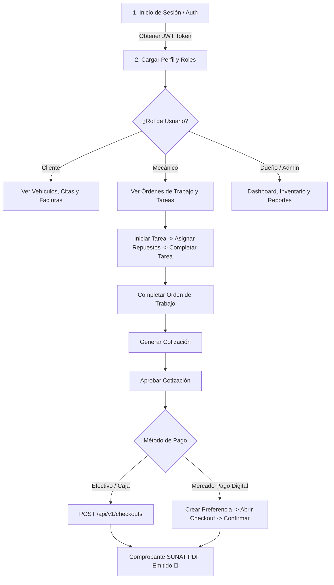

# 📚 ShiftIQ Platform — Guía Oficial de Endpoints de la API REST

Documentación técnica y funcional de la API REST de **ShiftIQ Platform** diseñada específicamente para los desarrolladores frontend (Web y Mobile).

---

## 🧭 1. Guía Rápida para el Desarrollador Frontend

### 🌐 Entornos y URLs Base

| Entorno | URL Base | Descripción |
| :--- | :--- | :--- |
| **Producción (Render)** | `https://shiftiq-platform.onrender.com` | Servidor cloud con HTTPS activo. |
| **Local (Desarrollo)** | `http://localhost:8080` | Servidor local Spring Boot. |
| **Swagger UI Interactivo** | `https://shiftiq-platform.onrender.com/swagger-ui/index.html` | Interfaz interactiva de prueba. |

### 🔐 Autenticación y Manejo de Tokens JWT

La mayoría de los endpoints están protegidos mediante **JWT (JSON Web Token)** con arquitectura stateless:

1. Al iniciar sesión (`POST /api/v1/authentication/sessions`) o registrarte, el backend devuelve:
   - `token`: Access Token de corta duración (enviar en cada petición).
   - `refreshToken`: Token de larga duración para renovar la sesión sin volver a pedir usuario y contraseña.
   - `accessTokenExpiresInSeconds`: Tiempo de vida del access token en segundos.
2. En cada petición protegida, el frontend **debe** incluir la cabecera HTTP:
   ```http
   Authorization: Bearer <token>
   ```
3. Cuando el backend responda `401 Unauthorized`, el frontend debe invocar de inmediato `POST /api/v1/authentication/sessions/refresh` enviando el `refreshToken` para obtener un nuevo `token` de forma transparente.

### ⚠️ Formato Estándar de Errores

Cuando una petición falla (`400 Bad Request`, `404 Not Found`, `409 Conflict`, etc.), el backend retorna un JSON estructurado bajo el siguiente formato:

```json
{
  "code": "BAD_REQUEST",
  "message": "Field plateNumber: Plate number is required",
  "details": "Validation failed for request body"
}
```

---

## 📑 Tabla de Contenidos

1. [Sistema y Multimedia](#-2-sistema-y-multimedia)
2. [IAM — Identidad, Autenticación y Usuarios](#-3-iam--identidad-autenticación-y-usuarios)
3. [Core — Talleres, Sedes, Personal y Clientes](#-4-core--talleres-sedes-personal-y-clientes)
4. [Fleet — Vinculaciones, Contratación y Citas](#-5-fleet--gestión-de-flota-registros-y-citas)
5. [IoT — Vehículos, Dispositivos OBD2 y Telemetría](#-6-iot--vehículos-dispositivos-obd2-y-telemetría)
6. [Inventory — Productos, Repuestos y Lotes](#-7-inventory--inventario-y-repuestos)
7. [Operations — Catálogo de Servicios y Órdenes de Trabajo](#-8-operations--servicios-y-órdenes-de-trabajo)
8. [Billing — Cotizaciones, Facturación SUNAT y Mercado Pago](#-9-billing--cotizaciones-facturación-sunat-y-mercado-pago)
9. [Analytics — Métricas, KPIs y Dashboards](#-10-analytics--métricas-kpis-y-dashboards)

---

## ⚙️ 2. Sistema y Multimedia

### `GET /` — Ping de la Raíz
* **Seguridad:** Público
* **Descripción:** Endpoint raíz utilizado para verificar la conectividad de la aplicación.
* **Respuesta Exitosa (`200 OK`):**
```json
{
  "status": "UP",
  "app": "ShiftIQ Platform API",
  "docs": "/swagger-ui.html"
}
```

---

### `GET /health` — Health Check
* **Seguridad:** Público
* **Descripción:** Utilizado por servicios de orquestación (como Render, Kubernetes) y pantallas de diagnóstico en frontend para chequear la disponibilidad del backend.
* **Respuesta Exitosa (`200 OK`):**
```json
{
  "status": "UP"
}
```

---

### `POST /api/v1/media/upload` — Subida de Imágenes a Cloudinary
* **Seguridad:** Requiere Token (`Bearer JWT`)
* **Descripción:** Permite subir archivos multimedia (fotografías de inspección de vehículo, fotos de perfil, imágenes de repuestos) devolviendo la URL segura alojada en Cloudinary.
* **Request (`multipart/form-data`):**
  * `file`: Archivo binario (JPEG, PNG, WEBP, GIF, PDF).
  * `folder`: (Opcional, default: `general`) Subcarpeta en Cloudinary (ej: `vehicles`, `inspections`, `products`, `avatars`).
* **Respuesta Exitosa (`201 CREATED`):**
```json
{
  "url": "https://res.cloudinary.com/shiftiq/image/upload/v1728329482/vehicles/sample-photo.jpg"
}
```

---

## 🔑 3. IAM — Identidad, Autenticación y Usuarios

### `POST /api/v1/authentication/sessions` — Iniciar Sesión (Login)
* **Seguridad:** Público
* **Descripción:** Autentica a un usuario mediante correo y contraseña. Devuelve los tokens JWT para autorizar peticiones subsiguientes.
* **Request Body (`application/json`):**
```json
{
  "email": "juan.mecanico@shiftiq.com",
  "password": "Password123!"
}
```
* **Respuesta Exitosa (`200 OK`):**
```json
{
  "id": "e4f8b2d1-9a7c-4e8b-8c2d-1a2b3c4d5e6f",
  "email": "juan.mecanico@shiftiq.com",
  "role": "ROLE_EMPLOYEE",
  "token": "eyJhbGciOiJIUzI1NiIsInR5cCI6IkpXVCJ9...",
  "refreshToken": "d8c7b6a5-4321-4f9e-8d2a-112233445566",
  "accessTokenExpiresInSeconds": 900
}
```

---

### `POST /api/v1/authentication/sessions/google` — Login con Google OAuth
* **Seguridad:** Público
* **Descripción:** Autentica o sincroniza un usuario a partir de su ID Token emitido por Google Sign-In.
* **Request Body:**
```json
{
  "idToken": "eyJhbGciOiJSUzI1NiIsImtpZCI6IjEyMzQ1NiI..."
}
```
* **Respuesta Exitosa (`200 OK`):** Retorna la misma estructura `AuthenticatedUserResource` que el login normal.

---

### `POST /api/v1/authentication/sessions/refresh` — Refrescar Sesión
* **Seguridad:** Público
* **Descripción:** Intercambia un refresh token vigente por un nuevo Access Token y un nuevo Refresh Token cuando el actual ha expirado.
* **Request Body:**
```json
{
  "refreshToken": "d8c7b6a5-4321-4f9e-8d2a-112233445566"
}
```
* **Respuesta Exitosa (`200 OK`):** Retorna un nuevo `AuthenticatedUserResource`.

---

### `DELETE /api/v1/authentication/sessions` — Cerrar Sesión (Logout)
* **Seguridad:** Público / Token
* **Descripción:** Invalida y revoca el refresh token indicado para cerrar la sesión en el servidor.
* **Request Body:**
```json
{
  "refreshToken": "d8c7b6a5-4321-4f9e-8d2a-112233445566"
}
```
* **Respuesta Exitosa (`204 NO CONTENT`)**

---

### `POST /api/v1/authentication/password-recoveries` — Solicitar Recuperación de Contraseña
* **Seguridad:** Público
* **Descripción:** Envía un correo electrónico con el enlace y token de recuperación.
* **Request Body:**
```json
{
  "email": "usuario@ejemplo.com"
}
```
* **Respuesta Exitosa (`200 OK` / `204 NO CONTENT`)**

---

### `POST /api/v1/authentication/password-resets` — Restablecer Contraseña
* **Seguridad:** Público
* **Descripción:** Aplica el cambio de contraseña usando el token recibido por correo electrónico.
* **Request Body:**
```json
{
  "token": "token-recibido-por-correo",
  "newPassword": "NuevaPasswordSegura2026!"
}
```
* **Respuesta Exitosa (`200 OK` / `204 NO CONTENT`)**

---

### `POST /api/v1/users` — Registrar Nuevo Usuario (Sign Up)
* **Seguridad:** Público
* **Descripción:** Registra una nueva cuenta de usuario en el sistema con un rol inicial (`ROLE_CUSTOMER`, `ROLE_EMPLOYEE`, o `ROLE_OWNER`).
* **Request Body:**
```json
{
  "email": "carlos.cliente@gmail.com",
  "password": "Password123!",
  "role": "ROLE_CUSTOMER"
}
```
* **Respuesta Exitosa (`201 CREATED`):**
```json
{
  "id": "7b8f9e01-1234-4567-89ab-cdef01234567",
  "email": "carlos.cliente@gmail.com",
  "role": "ROLE_CUSTOMER"
}
```

---

### `GET /api/v1/users/{userId}` — Obtener Usuario por ID
* **Seguridad:** Requiere Token (`Bearer JWT`, el usuario actual o Administrador)
* **Respuesta Exitosa (`200 OK`):**
```json
{
  "id": "7b8f9e01-1234-4567-89ab-cdef01234567",
  "email": "carlos.cliente@gmail.com",
  "role": "ROLE_CUSTOMER"
}
```

---

### `GET /api/v1/users?email={email}` — Buscar Usuario por Email
* **Seguridad:** Requiere Token
* **Query Params:** `email` (string)
* **Respuesta Exitosa (`200 OK`):** Retorna `UserResource`.

---

### `PUT /api/v1/users/{userId}/email` — Actualizar Email
* **Seguridad:** Requiere Token
* **Request Body:**
```json
{
  "email": "nuevo.email@gmail.com"
}
```
* **Respuesta Exitosa (`200 OK`):** Retorna `AuthenticatedUserResource` con nuevo token generado para el nuevo email.

---

### `PUT /api/v1/users/{userId}/password` — Actualizar Contraseña
* **Seguridad:** Requiere Token
* **Request Body:**
```json
{
  "currentPassword": "Password123!",
  "newPassword": "NuevaPassword456!"
}
```
* **Respuesta Exitosa (`200 OK`):**
```json
{
  "message": "Password updated successfully"
}
```

---

## 🏢 4. Core — Talleres, Sedes, Personal y Clientes

### 🏷️ Talleres (Workshops)

#### `POST /api/v1/workshops` — Crear Taller
* **Seguridad:** Requiere Token (`ROLE_OWNER`)
* **Request Body:**
```json
{
  "ownerId": "a1b2c3d4-1111-2222-3333-444455556666",
  "businessName": "Taller Mecánico Hermanos Castro S.A.C.",
  "brandName": "Castro Motors",
  "taxId": "20549876123",
  "mileageIntervalConfig": 5000
}
```
* **Respuesta Exitosa (`201 CREATED`):**
```json
{
  "id": "b2c3d4e5-2222-3333-4444-555566667777",
  "ownerId": "a1b2c3d4-1111-2222-3333-444455556666",
  "businessName": "Taller Mecánico Hermanos Castro S.A.C.",
  "brandName": "Castro Motors",
  "taxId": "20549876123",
  "mileageIntervalConfig": 5000
}
```

#### `PUT /api/v1/workshops/{workshopId}` — Actualizar Taller
* **Request Body:**
```json
{
  "businessName": "Castro Motors Premium S.A.C.",
  "brandName": "Castro Motors Pro",
  "taxId": "20549876123",
  "mileageIntervalConfig": 7500
}
```
* **Respuesta Exitosa (`200 OK`):** Retorna `WorkshopResource` actualizado.

#### `GET /api/v1/workshops/{workshopId}` — Obtener Taller por ID
* **Respuesta Exitosa (`200 OK`):** Retorna `WorkshopResource`.

#### `GET /api/v1/workshops?ownerId={ownerId}` — Listar Talleres del Dueño
* **Query Params:** `ownerId` (UUID)
* **Respuesta Exitosa (`200 OK`):** Retorna `List<WorkshopResource>`.

---

### 📍 Sedes (Branches)

#### `POST /api/v1/branches` — Crear Sede para un Taller
* **Seguridad:** Requiere Token (`ROLE_OWNER`)
* **Request Body:**
```json
{
  "workshopId": "b2c3d4e5-2222-3333-4444-555566667777",
  "code": "BR-SURCO-01",
  "name": "Sede Principal Santiago de Surco",
  "address": "Av. Primavera 1234, Santiago de Surco, Lima",
  "phone": "+51987654321"
}
```
* **Respuesta Exitosa (`201 CREATED`):**
```json
{
  "id": "c3d4e5f6-3333-4444-5555-666677778888",
  "workshopId": "b2c3d4e5-2222-3333-4444-555566667777",
  "code": "BR-SURCO-01",
  "name": "Sede Principal Santiago de Surco",
  "address": "Av. Primavera 1234, Santiago de Surco, Lima",
  "phone": "+51987654321"
}
```

#### `PUT /api/v1/branches/{branchId}` — Actualizar Sede
* **Request Body:**
```json
{
  "code": "BR-SURCO-01",
  "name": "Sede Surco Premium",
  "address": "Av. Primavera 1250, Santiago de Surco, Lima",
  "phone": "+51999888777"
}
```
* **Respuesta Exitosa (`200 OK`):** Retorna `BranchResource`.

#### `GET /api/v1/branches/{branchId}` — Obtener Sede por ID
* **Respuesta Exitosa (`200 OK`):** Retorna `BranchResource`.

#### `GET /api/v1/branches?workshopId={workshopId}` — Listar Sedes de un Taller
* **Query Params:** `workshopId` (UUID)
* **Respuesta Exitosa (`200 OK`):** Retorna `List<BranchResource>`.

#### `POST /api/v1/branches/{branchId}/subscriptions` — Asignar Suscripción a Sede
* **Request Body:**
```json
{
  "planId": "f1e2d3c4-9999-8888-7777-666655554444",
  "billingCycle": "MONTHLY"
}
```
* **Respuesta Exitosa (`201 CREATED`):**
```json
{
  "id": "d4e5f6a7-4444-5555-6666-777788889999",
  "branchId": "c3d4e5f6-3333-4444-5555-666677778888",
  "planId": "f1e2d3c4-9999-8888-7777-666655554444",
  "billingCycle": "MONTHLY",
  "status": "ACTIVE",
  "startDate": "2026-10-01T00:00:00Z",
  "endDate": "2026-11-01T00:00:00Z"
}
```

#### `DELETE /api/v1/branches/{branchId}/subscription` — Cancelar Suscripción
* **Respuesta Exitosa (`204 NO CONTENT`)**

---

### 👤 Perfiles de Dueño (Owners)

#### `POST /api/v1/owners` — Crear Registro de Dueño
* **Request Body:**
```json
{
  "userId": "e4f8b2d1-9a7c-4e8b-8c2d-1a2b3c4d5e6f",
  "firstName": "Raúl",
  "lastName": "Castro",
  "documentType": "DNI",
  "documentNumber": "45678901",
  "phone": "+51987112233"
}
```
* **Respuesta Exitosa (`201 CREATED`):** Retorna `OwnerResource`.

#### `GET /api/v1/owners/{ownerId}` — Obtener Dueño por ID
#### `GET /api/v1/owners?userId={userId}` — Obtener Dueño por ID de Usuario
#### `PUT /api/v1/owners/{ownerId}` — Actualizar Dueño
#### `DELETE /api/v1/owners/{ownerId}` — Eliminar Dueño

---

### 🔧 Perfiles de Empleado (Employees)

#### `POST /api/v1/employees` — Crear Registro de Empleado
* **Request Body:**
```json
{
  "userId": "e4f8b2d1-9a7c-4e8b-8c2d-1a2b3c4d5e6f",
  "firstName": "Luis",
  "lastName": "Mendoza",
  "documentType": "DNI",
  "documentNumber": "71234567",
  "phone": "+51912345678"
}
```
* **Respuesta Exitosa (`201 CREATED`):** Retorna `EmployeeResource`.

#### `GET /api/v1/employees/{employeeId}` — Obtener Empleado por ID
#### `GET /api/v1/employees?userId={userId}` — Obtener Empleado por ID de Usuario
#### `GET /api/v1/employees?documentNumber={documentNumber}` — Buscar por DNI
#### `PUT /api/v1/employees/{employeeId}` — Actualizar Empleado
#### `DELETE /api/v1/employees/{employeeId}` — Eliminar Empleado
* **Autorización:** `POST` y `GET` aceptan `ADMIN`, el propio usuario o `ROLE_OWNER` (bypass de perfiles globales); `PUT` y `DELETE` solo aceptan `ADMIN` o el propio usuario (`validateSelfAccess`, sin bypass de `ROLE_OWNER`).

---

### 🚗 Perfiles de Cliente (Customers)

#### `POST /api/v1/customers` — Crear Registro de Cliente
* **Request Body:**
```json
{
  "userId": "7b8f9e01-1234-4567-89ab-cdef01234567",
  "firstName": "María",
  "lastName": "Fernández",
  "businessName": null,
  "documentType": "DNI",
  "documentNumber": "48765432",
  "phone": "+51922334455"
}
```
* **Respuesta Exitosa (`201 CREATED`):**
```json
{
  "id": "e5f6a7b8-5555-6666-7777-888899990000",
  "userId": "7b8f9e01-1234-4567-89ab-cdef01234567",
  "isCorporate": false,
  "firstName": "María",
  "lastName": "Fernández",
  "businessName": null,
  "documentType": "DNI",
  "documentNumber": "48765432",
  "phone": "+51922334455"
}
```

#### `GET /api/v1/customers/{customerId}` — Obtener Cliente por ID
#### `GET /api/v1/customers?userId={userId}` — Obtener Cliente por ID de Usuario
#### `PUT /api/v1/customers/{customerId}` — Actualizar Cliente
#### `DELETE /api/v1/customers/{customerId}` — Eliminar Cliente
* **Autorización:** `POST` y `GET` aceptan `ADMIN`, el propio usuario o `ROLE_OWNER` (bypass de perfiles globales); `PUT` y `DELETE` solo aceptan `ADMIN` o el propio usuario (`validateSelfAccess`, sin bypass de `ROLE_OWNER`).

---

### 🎭 Perfiles de Roles del Sistema (Profiles)

#### `GET /api/v1/profiles/roles?userId={userId}` — Obtener Roles Activos del Usuario
* **Descripción:** Devuelve los roles que tiene configurado el usuario en los perfiles de la base de datos (ej. `OWNER`, `EMPLOYEE`, `CUSTOMER`). Muy útil para saber a qué menú o dashboard redirigir al iniciar sesión.
* **Respuesta Exitosa (`200 OK`):**
```json
[
  "ROLE_OWNER",
  "ROLE_EMPLOYEE"
]
```

#### `GET /api/v1/profiles?documentNumber={documentNumber}` — Buscar Perfil por DNI
* **Respuesta Exitosa (`200 OK`):** Retorna la información combinada del perfil asociado a ese documento.

---

## 🚗 5. Fleet — Gestión de Flota, Registros y Citas

### 📝 Vinculaciones de Clientes a Sedes (Customer Registrations)

#### `POST /api/v1/customer-registrations` — Registrar Cliente en Sede
* **Request Body:**
```json
{
  "branchId": "c3d4e5f6-3333-4444-5555-666677778888",
  "customerId": "e5f6a7b8-5555-6666-7777-888899990000"
}
```
* **Respuesta Exitosa (`201 CREATED`):** Retorna `CustomerRegistrationResource` con `status: "ACTIVE"`.

#### `GET /api/v1/customer-registrations` — Listar Registros con Filtros
* **Query Params:**
  * `branchId` (opcional): UUID de la sede.
  * `status` (opcional): `ACTIVE`, `INACTIVE`.
  * `customerId` (opcional): UUID del cliente.
* **Respuesta Exitosa (`200 OK`):** Retorna `List<CustomerRegistrationResource>`.

#### `GET /api/v1/customer-registrations/{registrationId}` — Detalle de Vinculación
* **Seguridad:** Requiere Token
* **Descripción:** Devuelve el detalle de una vinculación cliente↔sede por su ID.
* **Respuesta Exitosa (`200 OK`):** Retorna `CustomerRegistrationResource`.

#### `PUT /api/v1/customer-registrations/{registrationId}` — Cambiar Estado
* **Request Body:**
```json
{
  "status": "INACTIVE"
}
```
* **Respuesta Exitosa (`200 OK`):** Retorna `CustomerRegistrationResource`.

#### `DELETE /api/v1/customer-registrations/{registrationId}` — Desactivar Registro
* **Respuesta Exitosa (`204 NO CONTENT`)**

---

### 👷 Flujo de Solicitud y Contratación de Mecánicos (Employee Registrations)

#### `POST /api/v1/employee-registrations` — Crear Registro de Empleado en Sede
* **Seguridad:** Requiere Token (Administrador o con acceso a la sede)
* **Descripción:** Crea directamente un registro de empleado en una sede (alta manual), sin pasar por el flujo de `request-join` + aprobación. El registro nace en estado `ACTIVE`.
* **Request Body:**
```json
{
  "employeeId": "a2b3c4d5-6666-7777-8888-999900001111",
  "branchId": "c3d4e5f6-3333-4444-5555-666677778888",
  "speciality": "MOTOR_DIESEL",
  "specialityName": "Especialista en Motores Diésel e Inyección",
  "salary": 2500.00
}
```
* **Respuesta Exitosa (`201 CREATED`):** Retorna `EmployeeRegistrationResource`.

#### `POST /api/v1/employee-registrations/request-join` — Mecánico Solicita Unirse a Sede
* **Seguridad:** Requiere Token (`ROLE_EMPLOYEE`)
* **Descripción:** Un mecánico solicita unirse a una sede específica. La solicitud queda en estado `PENDING_APPROVAL`.
* **Request Body:**
```json
{
  "employeeId": "a2b3c4d5-6666-7777-8888-999900001111",
  "branchId": "c3d4e5f6-3333-4444-5555-666677778888",
  "speciality": "MOTOR_DIESEL",
  "specialityName": "Especialista en Motores Diésel e Inyección",
  "salary": 2500.00
}
```
* **Respuesta Exitosa (`201 CREATED`):**
```json
{
  "id": "f6a7b8c9-7777-8888-9999-000011112222",
  "employeeId": "a2b3c4d5-6666-7777-8888-999900001111",
  "branchId": "c3d4e5f6-3333-4444-5555-666677778888",
  "speciality": "MOTOR_DIESEL",
  "specialityName": "Especialista en Motores Diésel e Inyección",
  "salary": 2500.00,
  "status": "PENDING_APPROVAL",
  "createdAt": "2026-10-07T12:00:00Z"
}
```

#### `POST /api/v1/employee-registrations/{id}/approve` — Aprobar Mecánico
* **Seguridad:** Requiere Token (`ROLE_OWNER` o Administrador de la Sede)
* **Descripción:** El dueño del taller aprueba la solicitud. El estado cambia a `ACTIVE`.
* **Respuesta Exitosa (`200 OK`):** Retorna `EmployeeRegistrationResource` con `status: "ACTIVE"`.

#### `POST /api/v1/employee-registrations/{id}/reject` — Rechazar Solicitud
* **Request Body:**
```json
{
  "reason": "La sede ya no cuenta con vacantes para el turno solicitado"
}
```
* **Respuesta Exitosa (`200 OK`):** Retorna `EmployeeRegistrationResource` con `status: "REJECTED"`.

#### `GET /api/v1/employee-registrations` — Listar Registros de Empleados
* **Query Params:**
  * `branchId` (opcional): UUID de la sede.
  * `status` (opcional): `ACTIVE`, `PENDING_APPROVAL`, `REJECTED`, `INACTIVE`.
  * `employeeId` (opcional): UUID del empleado.
* **Respuesta Exitosa (`200 OK`):** Retorna `List<EmployeeRegistrationResource>`.

#### `GET /api/v1/employee-registrations/{id}` — Detalle de Registro de Empleado
* **Seguridad:** Requiere Token
* **Descripción:** Devuelve el detalle de un registro de empleado en una sede por su ID.
* **Respuesta Exitosa (`200 OK`):** Retorna `EmployeeRegistrationResource`.

#### `PUT /api/v1/employee-registrations/{id}` — Actualizar Especialidad / Salario
* **Request Body:**
```json
{
  "speciality": "SISTEMAS_ELECTRONICOS",
  "specialityName": "Diagnóstico Electrónico y OBD2",
  "salary": 3200.00
}
```
* **Respuesta Exitosa (`200 OK`):** Retorna `EmployeeRegistrationResource`.

#### `DELETE /api/v1/employee-registrations/{id}` — Dar de Baja Empleado en Sede
* **Respuesta Exitosa (`204 NO CONTENT`)**

---

### 📅 Citas de Taller (Appointments)

#### `POST /api/v1/appointments` — Agendar Nueva Cita
* **Request Body:**
```json
{
  "branchId": "c3d4e5f6-3333-4444-5555-666677778888",
  "customerId": "e5f6a7b8-5555-6666-7777-888899990000",
  "vehicleId": "b1a2c3d4-8888-9999-0000-111122223333",
  "scheduledStart": "2026-10-15T09:00:00",
  "scheduledEnd": "2026-10-15T11:00:00",
  "notes": "Mantenimiento preventivo de los 20,000 km y revisión de pastillas de freno."
}
```
* **Respuesta Exitosa (`201 CREATED`):**
```json
{
  "id": "a7b8c9d0-8888-9999-0000-111122223333",
  "branchId": "c3d4e5f6-3333-4444-5555-666677778888",
  "customerId": "e5f6a7b8-5555-6666-7777-888899990000",
  "vehicleId": "b1a2c3d4-8888-9999-0000-111122223333",
  "scheduledStart": "2026-10-15T09:00:00",
  "scheduledEnd": "2026-10-15T11:00:00",
  "status": "SCHEDULED",
  "notes": "Mantenimiento preventivo de los 20,000 km y revisión de pastillas de freno."
}
```

#### `GET /api/v1/appointments` — Listar Citas con Filtros
* **Query Params:**
  * `branchId` (opcional): UUID
  * `status` (opcional): `SCHEDULED`, `CONFIRMED`, `IN_PROGRESS`, `COMPLETED`, `CANCELLED`
  * `customerId` (opcional): UUID
  * `vehicleId` (opcional): UUID
* **Respuesta Exitosa (`200 OK`):** Retorna `List<AppointmentResource>`.

#### `GET /api/v1/appointments/{appointmentId}` — Detalle de Cita
* **Respuesta Exitosa (`200 OK`):** Retorna `AppointmentResource`.

#### `PUT /api/v1/appointments/{appointmentId}` — Modificar Cita
* **Request Body:**
```json
{
  "branchId": "c3d4e5f6-3333-4444-5555-666677778888",
  "customerId": "e5f6a7b8-5555-6666-7777-888899990000",
  "vehicleId": "b1a2c3d4-8888-9999-0000-111122223333",
  "scheduledStart": "2026-10-16T14:00:00",
  "scheduledEnd": "2026-10-16T16:00:00",
  "status": "CONFIRMED",
  "notes": "Cliente reprogramó para la tarde."
}
```
* **Respuesta Exitosa (`200 OK`):** Retorna `AppointmentResource`.

#### `DELETE /api/v1/appointments/{appointmentId}` — Cancelar Cita
* **Respuesta Exitosa (`204 NO CONTENT`)**

---

## 📡 6. IoT — Vehículos, Dispositivos OBD2 y Telemetría

### 🚘 Vehículos del Cliente (Vehicles)

#### `POST /api/v1/vehicles` — Registrar Vehículo
* **Seguridad:** Requiere Token (`ROLE_CUSTOMER` o `ROLE_OWNER`)
* **Descripción:** Registra un vehículo y lo vincula automáticamente al usuario autenticado.
* **Request Body:**
```json
{
  "plateNumber": "ABC-123",
  "brand": "Toyota",
  "model": "Corolla Cross",
  "year": 2023,
  "vin": "9BRBL3HE2P0123456",
  "photoUrl": "https://res.cloudinary.com/shiftiq/image/upload/v1728329482/vehicles/corolla.jpg"
}
```
* **Respuesta Exitosa (`201 CREATED`):**
```json
{
  "id": "b1a2c3d4-8888-9999-0000-111122223333",
  "plateNumber": "ABC-123",
  "brand": "Toyota",
  "model": "Corolla Cross",
  "year": 2023,
  "vin": "9BRBL3HE2P0123456",
  "photoUrl": "https://res.cloudinary.com/shiftiq/image/upload/v1728329482/vehicles/corolla.jpg"
}
```

#### `GET /api/v1/vehicles?branchId={branchId}&status={status}` — Listar Vehículos por Sede
* **Seguridad:** Requiere Token (acceso a la sede)
* **Descripción:** Lista los vehículos de una sede. Único valor soportado para `status` hoy: `available-for-linking` (vehículos listos para vincular a un escáner OBD2); cualquier otro valor responde `422 Unprocessable Content`.
* **Query Params:**
  * `branchId`: UUID de la sede (obligatorio).
  * `status`: `available-for-linking` (obligatorio).
* **Respuesta Exitosa (`200 OK`):** Retorna `List<VehicleResource>`.

#### `GET /api/v1/customers/{customerId}/vehicles` — Listar Vehículos de un Cliente
* **Respuesta Exitosa (`200 OK`):** Retorna `List<VehicleResource>`.

#### `GET /api/v1/vehicles/{id}` — Detalle de Vehículo
* **Respuesta Exitosa (`200 OK`):** Retorna `VehicleResource`.

#### `PUT /api/v1/vehicles/{id}` — Actualizar Vehículo
* **Request Body:** Retorna `UpdateVehicleResource`.
* **Respuesta Exitosa (`200 OK`):** Retorna `VehicleResource`.

#### `DELETE /api/v1/vehicles/{id}` — Eliminar Vehículo
* **Respuesta Exitosa (`204 NO CONTENT`)**

#### `GET /api/v1/vehicles/{vehicleId}/telemetry-snapshots` — Historial de Telemetría
* **Descripción:** Devuelve la lista completa de lecturas enviadas por el escáner OBD2 para este vehículo.
* **Respuesta Exitosa (`200 OK`):** Retorna `List<TelemetrySnapshotResource>`.

#### `GET /api/v1/vehicles/{vehicleId}/dtc-alerts` — Historial de Alertas de Fallas DTC
* **Descripción:** Lista los códigos de diagnóstico de problemas (DTC / Check Engine) detectados en el vehículo.
* **Respuesta Exitosa (`200 OK`):**
```json
[
  {
    "id": "e8d9c0b1-1111-2222-3333-444455556666",
    "telemetrySnapshotId": "a1b2c3d4-5555-6666-7777-888899990000",
    "branchId": "c3d4e5f6-3333-4444-5555-666677778888",
    "dtcCode": "P0300",
    "description": "Random/Multiple Cylinder Misfire Detected",
    "severity": "HIGH",
    "createdAt": "2026-10-07T08:30:00Z"
  }
]
```

---

### 🔌 Dispositivos Físicos OBD2 (Obd2 Devices)

#### `POST /api/v1/obd2-devices` — Registrar Dispositivo OBD2
* **Request Body:**
```json
{
  "branchId": "c3d4e5f6-3333-4444-5555-666677778888",
  "macAddress": "00:1B:44:11:3A:B7"
}
```
* **Respuesta Exitosa (`201 CREATED`):**
```json
{
  "id": "c1d2e3f4-0000-1111-2222-333344445555",
  "branchId": "c3d4e5f6-3333-4444-5555-666677778888",
  "macAddress": "00:1B:44:11:3A:B7",
  "status": "AVAILABLE"
}
```

#### `GET /api/v1/obd2-devices?branchId={branchId}&status=available` — Listar Dispositivos
* **Query Params:**
  * `branchId`: UUID de la sede (obligatorio)
  * `status`: `available` (opcional, para listar solo los escáneres listos para vincular)
* **Respuesta Exitosa (`200 OK`):** Retorna `List<Obd2DeviceResource>`.

#### `GET /api/v1/obd2-devices/{id}` — Detalle de Dispositivo OBD2
* **Respuesta Exitosa (`200 OK`):** Retorna `Obd2DeviceResource`.
* **Errores:** `404 Not Found` si el dispositivo no existe.

#### `PUT /api/v1/obd2-devices/{id}` — Actualizar Dispositivo OBD2
* **Descripción:** Actualiza los datos del escáner (por ejemplo la dirección MAC).
* **Request Body:**
```json
{
  "macAddress": "00:1B:44:11:3A:B8"
}
```
* **Respuesta Exitosa (`200 OK`):** Retorna `Obd2DeviceResource` actualizado.

#### `DELETE /api/v1/obd2-devices/{id}` — Eliminar Dispositivo OBD2 (Soft Delete)
* **Descripción:** Realiza una eliminación lógica del escáner.
* **Respuesta Exitosa (`204 NO CONTENT`)**
* **Errores:** `400 Bad Request` (estado inválido), `409 Conflict` (duplicado).

#### `GET /api/v1/obd2-devices/{deviceId}/telemetry-snapshots/latest` — Última Lectura en Vivo
* **Descripción:** Endpoint clave para la pantalla de "Dashboard en Vivo" del vehículo en la app móvil.
* **Respuesta Exitosa (`200 OK`):**
```json
{
  "id": "f2e1d0c9-9999-8888-7777-666655554444",
  "obd2DeviceRegistrationId": "d3c2b1a0-1234-5678-90ab-cdef12345678",
  "branchId": "c3d4e5f6-3333-4444-5555-666677778888",
  "rpm": 2450,
  "temperature": 89,
  "speedKmh": 62.5,
  "odometerKm": 24890,
  "fuelLevelPercent": 74.0,
  "createdAt": "2026-10-07T12:15:30Z"
}
```

#### `GET /api/v1/obd2-devices/{deviceId}/telemetry-snapshots` — Historial de Telemetría del Dispositivo
* **Descripción:** Devuelve todo el historial de lecturas del escáner OBD2, ordenado de más reciente a más antiguo.
* **Query Params:**
  * `page` (opcional, default `0`): número de página.
  * `size` (opcional, default `20`): tamaño de página.
* **Respuesta Exitosa (`200 OK`):** Retorna `List<TelemetrySnapshotResource>`.

---

### 🔗 Vinculación OBD2 <-> Vehículo (Obd2 Device Registrations)

#### `POST /api/v1/obd2-device-registrations` — Vincular OBD2 a un Vehículo
* **Request Body:**
```json
{
  "obd2DeviceId": "c1d2e3f4-0000-1111-2222-333344445555",
  "branchId": "c3d4e5f6-3333-4444-5555-666677778888",
  "vehicleId": "b1a2c3d4-8888-9999-0000-111122223333"
}
```
* **Respuesta Exitosa (`201 CREATED`):** Retorna `Obd2DeviceRegistrationResource` con `status: "ACTIVE"`.

#### `PATCH /api/v1/obd2-device-registrations/{id}` — Desvincular / Cambiar Estado
* **Request Body:**
```json
{
  "status": "INACTIVE"
}
```
* **Respuesta Exitosa (`200 OK`):** Retorna `Obd2DeviceRegistrationResource`.

#### `GET /api/v1/obd2-device-registrations?branchId={branchId}&status={status}` — Listar Vinculaciones
* **Seguridad:** Requiere Token (acceso a la sede)
* **Descripción:** Lista las vinculaciones escáner↔vehículo de una sede filtradas por estado.
* **Query Params:**
  * `branchId`: UUID de la sede (obligatorio).
  * `status`: estado de la vinculación, ej. `ACTIVE`, `INACTIVE` (obligatorio).
* **Respuesta Exitosa (`200 OK`):** Retorna `List<Obd2DeviceRegistrationResource>`.

#### `GET /api/v1/obd2-device-registrations/{id}/telemetry-snapshots` — Telemetría de la Vinculación
* **Descripción:** Lecturas capturadas bajo esa vinculación escáner↔vehículo.
* **Query Params:** `page` (default `0`), `size` (default `20`).
* **Respuesta Exitosa (`200 OK`):** Retorna `List<TelemetrySnapshotResource>`.

#### `GET /api/v1/obd2-device-registrations/{id}/dtc-alerts` — Alertas DTC de la Vinculación
* **Descripción:** Códigos de falla (DTC) detectados en el vehículo durante esa vinculación.
* **Query Params:** `page` (default `0`), `size` (default `20`).
* **Respuesta Exitosa (`200 OK`):** Retorna `List<DtcAlertResource>`.

---

### 📦 Ingesta de Telemetría (Telemetry Batches)

#### `POST /api/v1/telemetry-batches` — Ingestar Lote de Telemetría
* **Seguridad:** Requiere Token
* **Descripción:** Utilizado por los gateways IoT o emuladores para enviar ráfagas de datos de sensores y códigos DTC.
* **Request Body:**
```json
{
  "obd2DeviceId": "c1d2e3f4-0000-1111-2222-333344445555",
  "snapshots": [
    {
      "rpm": 2200,
      "temperature": 91,
      "speedKmh": 55.4,
      "odometerKm": 25100,
      "fuelLevelPercent": 68.5,
      "createdAt": "2026-10-07T12:20:00Z",
      "dtcCodes": [
        {
          "dtcCode": "P0420",
          "description": "Catalyst System Efficiency Below Threshold (Bank 1)",
          "severity": "MEDIUM"
        }
      ]
    }
  ]
}
```
* **Respuesta Exitosa (`201 CREATED`):**
```json
{
  "message": "Telemetry batch ingested successfully"
}
```

---

## 📦 7. Inventory — Inventario y Repuestos

### `POST /api/v1/inventory/products` — Crear Producto / Repuesto
* **Seguridad:** Requiere Token (`ROLE_OWNER` o Administrador de Sede)
* **Request Body:**
```json
{
  "branchId": "c3d4e5f6-3333-4444-5555-666677778888",
  "category": "Filtros",
  "name": "Filtro de Aceite Sintético Premium",
  "sku": "FLT-OIL-001",
  "description": "Filtro de alto flujo para motores de 4 cilindros",
  "salePrice": 45.00,
  "minimumStock": 5
}
```
* **Respuesta Exitosa (`201 CREATED`):**
```json
{
  "id": "e1f2a3b4-1010-2020-3030-404050506060",
  "branchId": "c3d4e5f6-3333-4444-5555-666677778888",
  "category": "Filtros",
  "name": "Filtro de Aceite Sintético Premium",
  "sku": "FLT-OIL-001",
  "description": "Filtro de alto flujo para motores de 4 cilindros",
  "salePrice": 45.00,
  "minimumStock": 5,
  "currentStock": 0,
  "lowStockAlert": true
}
```

---

### `GET /api/v1/inventory/products?branchId={branchId}` — Listar Productos con Filtros
* **Query Params:**
  * `branchId`: UUID de la sede (obligatorio)
  * `name` (opcional): Filtro por nombre parcial.
  * `category` (opcional): Filtro por categoría.
  * `lowStockOnly` (opcional, boolean): Si es `true`, devuelve solo productos con stock menor o igual al mínimo.
* **Respuesta Exitosa (`200 OK`):** Retorna `List<ProductResource>`.

---

### `GET /api/v1/inventory/products/branch/{branchId}` — Catálogo de Productos
* **Descripción:** Endpoint simplificado de catálogo para cargar listas en selectores de la app móvil.
* **Respuesta Exitosa (`200 OK`):** Retorna `List<ProductResource>`.

---

### `GET /api/v1/inventory/products/{productId}` — Detalle del Producto con Lotes
* **Descripción:** Devuelve la información del repuesto y todos los lotes de compra asociados (historial de entradas).
* **Respuesta Exitosa (`200 OK`):**
```json
{
  "id": "e1f2a3b4-1010-2020-3030-404050506060",
  "branchId": "c3d4e5f6-3333-4444-5555-666677778888",
  "category": "Filtros",
  "name": "Filtro de Aceite Sintético Premium",
  "sku": "FLT-OIL-001",
  "description": "Filtro de alto flujo para motores de 4 cilindros",
  "salePrice": 45.00,
  "minimumStock": 5,
  "currentStock": 20,
  "lowStockAlert": false,
  "batches": [
    {
      "batchId": "BATCH-2026-10-A",
      "initialQuantity": 20,
      "availableQuantity": 20,
      "acquisitionCost": 22.50,
      "createdAt": "2026-10-05T10:00:00Z"
    }
  ]
}
```

---

### `PUT /api/v1/inventory/products/{productId}` — Actualizar Información de Producto
* **Request Body:**
```json
{
  "name": "Filtro de Aceite Sintético Pro Ultra",
  "category": "Filtros y Lubricantes",
  "sku": "FLT-OIL-001",
  "description": "Filtro de alto rendimiento certificado",
  "salePrice": 50.00,
  "minimumStock": 8
}
```
* **Respuesta Exitosa (`200 OK`):** Retorna `ProductResource`.

---

### `POST /api/v1/inventory/products/{productId}/batches` — Ingreso de Lote o Ajuste de Stock
* **Descripción:** Añade stock al inventario (ingreso de compras) o realiza ajustes negativos.
* **Request Body:**
```json
{
  "quantity": 15,
  "acquisitionCost": 24.00
}
```
* **Respuesta Exitosa (`200 OK`):**
```json
{
  "message": "Stock batch updated successfully",
  "currentStock": 35
}
```

---

### `DELETE /api/v1/inventory/products/{productId}` — Eliminar Producto
* **Respuesta Exitosa (`204 NO CONTENT`)**

---

## 🛠️ 8. Operations — Servicios y Órdenes de Trabajo

### 📑 Catálogo de Servicios (Services)

#### `POST /api/v1/services` — Crear Servicio
* **Request Body:**
```json
{
  "branchId": "c3d4e5f6-3333-4444-5555-666677778888",
  "name": "Alineación y Balanceo Computarizado",
  "price": 80.00
}
```
* **Respuesta Exitosa (`201 CREATED`):**
```json
{
  "id": "s1s2s3s4-1111-2222-3333-444455556666",
  "branchId": "c3d4e5f6-3333-4444-5555-666677778888",
  "name": "Alineación y Balanceo Computarizado",
  "price": 80.00
}
```

#### `GET /api/v1/services?branchId={branchId}` — Listar Servicios de la Sede
* **Respuesta Exitosa (`200 OK`):** Retorna `List<ServiceResource>`.

#### `PUT /api/v1/services/{serviceId}` — Actualizar Servicio
* **Request Body:**
```json
{
  "name": "Alineación 3D y Balanceo",
  "price": 95.00
}
```
* **Respuesta Exitosa (`200 OK`):** Retorna `ServiceResource`.

#### `DELETE /api/v1/services/{serviceId}` — Eliminar Servicio
* **Respuesta Exitosa (`204 NO CONTENT`)**

---

### 📋 Órdenes de Trabajo (Work Orders)

#### `POST /api/v1/work-orders` — Crear Orden de Trabajo
* **Seguridad:** Requiere Token (`ROLE_EMPLOYEE`, `ROLE_OWNER`)
* **Descripción:** Abre una orden de trabajo a partir de una cita agendada, registrando el kilometraje inicial y las fotos de recepción.
* **Request Body:**
```json
{
  "appointmentId": "a7b8c9d0-8888-9999-0000-111122223333",
  "branchId": "c3d4e5f6-3333-4444-5555-666677778888",
  "vehicleId": "b1a2c3d4-8888-9999-0000-111122223333",
  "customerId": "e5f6a7b8-5555-6666-7777-888899990000",
  "diagnosticSummary": "Cliente reporta vibración en el volante al frenar a 80 km/h.",
  "mileageIn": 45200,
  "entryInspectionImages": [
    "https://res.cloudinary.com/shiftiq/image/upload/v1/inspections/front-bumper.jpg",
    "https://res.cloudinary.com/shiftiq/image/upload/v1/inspections/dashboard-mileage.jpg"
  ]
}
```
* **Respuesta Exitosa (`201 CREATED`):**
```json
{
  "id": "w1w2w3w4-0000-1111-2222-333344445555",
  "appointmentId": "a7b8c9d0-8888-9999-0000-111122223333",
  "branchId": "c3d4e5f6-3333-4444-5555-666677778888",
  "vehicleId": "b1a2c3d4-8888-9999-0000-111122223333",
  "customerId": "e5f6a7b8-5555-6666-7777-888899990000",
  "internalNumber": 1042,
  "formattedNumber": "OT-2026-001042",
  "status": "OPEN",
  "diagnosticSummary": "Cliente reporta vibración en el volante al frenar a 80 km/h.",
  "mileageIn": 45200,
  "totalAmount": 0.00,
  "tasks": [],
  "entryInspectionImages": [
    "https://res.cloudinary.com/shiftiq/image/upload/v1/inspections/front-bumper.jpg",
    "https://res.cloudinary.com/shiftiq/image/upload/v1/inspections/dashboard-mileage.jpg"
  ],
  "createdAt": "2026-10-07T09:00:00Z",
  "updatedAt": "2026-10-07T09:00:00Z"
}
```

#### `GET /api/v1/work-orders` — Listar Órdenes de Trabajo
* **Query Params:**
  * `branchId` (opcional): UUID
  * `vehicleId` (opcional): UUID
* **Respuesta Exitosa (`200 OK`):** Retorna `List<WorkOrderResource>`.

#### `GET /api/v1/work-orders/{id}` — Detalle Completo de Orden de Trabajo
* **Descripción:** Endpoint principal para la vista de detalle de la orden. Incluye todas sus tareas, mecánicos asignados, repuestos consumidos, fotos de evidencia y montos totales calculados.
* **Respuesta Exitosa (`200 OK`):** Retorna `WorkOrderResource`.

#### `PUT /api/v1/work-orders/{id}` — Actualizar Diagnóstico y Kilometraje
* **Request Body:**
```json
{
  "diagnosticSummary": "Diagnóstico confirmado: Discos de freno delanteros alabeados.",
  "mileageIn": 45205
}
```
* **Respuesta Exitosa (`200 OK`):** Retorna `WorkOrderResource`.

#### `POST /api/v1/work-orders/{id}/complete` — Completar Orden de Trabajo
* **Descripción:** Cierra la orden de trabajo. **Condición obligatoria:** Todas las tareas deben estar en estado `COMPLETED`. Dispara el cálculo del monto final para poder facturarla.
* **Respuesta Exitosa (`200 OK`):** Retorna `WorkOrderResource` con `status: "COMPLETED"`.

#### `DELETE /api/v1/work-orders/{id}` — Eliminar Orden de Trabajo
* **Descripción:** Cancela y borra la orden de trabajo, liberando de inmediato todas las reservas de stock en inventario.
* **Respuesta Exitosa (`204 NO CONTENT`)**

---

### 🔧 Tareas de Taller y Repuestos (Work Order Tasks)

#### `POST /api/v1/work-orders/{id}/tasks` — Agregar Tarea a la Orden
* **Request Body:**
```json
{
  "serviceId": "s1s2s3s4-1111-2222-3333-444455556666",
  "description": "Rectificado de discos y cambio de pastillas delanteras",
  "evidenceImages": [
    "https://res.cloudinary.com/shiftiq/image/upload/v1/tasks/disco-desgastado.jpg"
  ]
}
```
* **Respuesta Exitosa (`201 CREATED`):** Retorna `WorkOrderTaskResource` con `status: "PENDING"`.

#### `PUT /api/v1/work-orders/{id}/tasks/{taskId}` — Actualizar Detalles de la Tarea
* **Seguridad:** Requiere Token
* **Descripción:** Actualiza los datos técnicos de una tarea dentro de la orden: servicio asociado, mecánico responsable, descripción y fotos de evidencia.
* **Request Body:**
```json
{
  "serviceId": "s1s2s3s4-1111-2222-3333-444455556666",
  "assignedMechanicId": "a2b3c4d5-6666-7777-8888-999900001111",
  "description": "Rectificado de discos y cambio de pastillas delanteras",
  "evidenceImages": [
    "https://res.cloudinary.com/shiftiq/image/upload/v1/tasks/disco-desgastado.jpg"
  ]
}
```
* **Respuesta Exitosa (`200 OK`):** Retorna `WorkOrderTaskResource`.

#### `POST /api/v1/work-order-tasks/{taskId}/assign-mechanic` — Asignar Mecánico Responsable
* **Descripción:** Asigna al empleado que ejecutará la tarea técnica.
* **Query Params:** `mechanicId` (UUID)
* **Respuesta Exitosa (`200 OK`):** Retorna `WorkOrderTaskResource`.

#### `POST /api/v1/work-order-tasks/{taskId}/start` — Iniciar Tarea
* **Descripción:** Cambia el estado de la tarea a `DOING` y captura la marca de tiempo `startedAt`.
* **Respuesta Exitosa (`200 OK`):** Retorna `WorkOrderTaskResource` con `status: "DOING"`.

#### `POST /api/v1/work-order-tasks/{taskId}/complete` — Finalizar Tarea
* **Descripción:** Marca la tarea como `COMPLETED` y fija el timestamp `completedAt`.
* **Respuesta Exitosa (`200 OK`):** Retorna `WorkOrderTaskResource` con `status: "COMPLETED"`.

#### `POST /api/v1/work-order-tasks/{taskId}/reopen` — Reabrir Tarea
* **Descripción:** Si se requiere un ajuste, regresa la tarea al estado `DOING`.
* **Respuesta Exitosa (`200 OK`):** Retorna `WorkOrderTaskResource`.

#### `DELETE /api/v1/work-orders/{id}/tasks/{taskId}` — Eliminar Tarea
* **Descripción:** Elimina la tarea y libera los repuestos que estaban reservados para ella.
* **Respuesta Exitosa (`204 NO CONTENT`)**

#### `POST /api/v1/work-order-tasks/{taskId}/products` — Agregar Repuesto a la Tarea
* **Descripción:** Asocia un repuesto del inventario a la tarea. **Verifica stock y genera reserva inmediata.**
* **Request Body:**
```json
{
  "productId": "e1f2a3b4-1010-2020-3030-404050506060",
  "quantity": 2
}
```
* **Respuesta Exitosa (`201 CREATED`):**
```json
{
  "id": "p1p2p3p4-5555-6666-7777-888899990000",
  "productId": "e1f2a3b4-1010-2020-3030-404050506060",
  "branchId": "c3d4e5f6-3333-4444-5555-666677778888",
  "quantity": 2,
  "unitPrice": 45.00,
  "totalAmount": 90.00,
  "createdAt": "2026-10-07T10:15:00Z"
}
```

#### `PUT /api/v1/work-order-tasks/{taskId}/products/{productId}` — Modificar Cantidad de Repuesto
* **Request Body:**
```json
{
  "quantity": 3
}
```
* **Respuesta Exitosa (`200 OK`):** Retorna `WorkOrderTaskProductResource`.

#### `DELETE /api/v1/work-order-tasks/{taskId}/products/{productId}` — Quitar Repuesto de la Tarea
* **Descripción:** Quita el repuesto de la tarea y libera de vuelta el stock reservado en el inventario.
* **Respuesta Exitosa (`204 NO CONTENT`)**

---

## 💳 9. Billing — Cotizaciones, Facturación SUNAT y Mercado Pago

### 📑 Cotizaciones (Quotes)

#### `POST /api/v1/quotes` — Generar Cotización
* **Seguridad:** Requiere Token (`ROLE_EMPLOYEE`, `ROLE_OWNER`)
* **Descripción:** Crea una cotización oficial calculada a partir de los servicios y repuestos de una Orden de Trabajo.
* **Request Body:**
```json
{
  "workOrderId": "w1w2w3w4-0000-1111-2222-333344445555",
  "branchId": "c3d4e5f6-3333-4444-5555-666677778888",
  "discountPercentage": 10.0
}
```
* **Respuesta Exitosa (`201 CREATED`):**
```json
{
  "id": "q1q2q3q4-1234-5678-90ab-cdef12345678",
  "workOrderId": "w1w2w3w4-0000-1111-2222-333344445555",
  "branchId": "c3d4e5f6-3333-4444-5555-666677778888",
  "subtotalAmount": 250.00,
  "discountPercentage": 10.0,
  "totalAmount": 225.00,
  "status": "DRAFT"
}
```

#### `GET /api/v1/quotes/{id}` — Detalle de Cotización
* **Respuesta Exitosa (`200 OK`):** Retorna `QuoteResource`.

#### `GET /api/v1/quotes?branchId={branchId}` — Listar Cotizaciones de Sede
* **Respuesta Exitosa (`200 OK`):** Retorna `List<QuoteResource>`.

#### `PUT /api/v1/quotes/{id}` — Actualizar Descuento en Cotización DRAFT
* **Request Body:**
```json
{
  "discountPercentage": 15.0
}
```
* **Respuesta Exitosa (`200 OK`):** Retorna `QuoteResource` con `totalAmount` recalculado.

#### `POST /api/v1/quotes/{id}/approvals` — Aprobar Cotización
* **Descripción:** El cliente o asesor aprueba la cotización. Pasa de `DRAFT` a `APPROVED`, habilitando la emisión de comprobante y pago.
* **Respuesta Exitosa (`200 OK`):** Retorna `QuoteResource` con `status: "APPROVED"`.

#### `POST /api/v1/quotes/{id}/cancellations` — Cancelar Cotización
* **Respuesta Exitosa (`200 OK`):** Retorna `QuoteResource` con `status: "CANCELED"`.

---

### 🧾 Comprobantes Electrónicos SUNAT (Vouchers)

#### `POST /api/v1/vouchers` — Emitir Comprobante (Boleta / Factura)
* **Seguridad:** Requiere Token
* **Descripción:** Emite un comprobante legal conectándose en tiempo real con la API de Factos y la SUNAT.
* **Valores admitidos:**
  * `type`: `"RECEIPT"` (Boleta de Venta) o `"INVOICE"` (Factura).
  * `customerDocumentType`: `"DNI"` o `"RUC"`.
* **Request Body:**
```json
{
  "quoteId": "q1q2q3q4-1234-5678-90ab-cdef12345678",
  "type": "RECEIPT",
  "customerDocumentType": "DNI",
  "customerDocumentNumber": "48765432",
  "customerName": "María Fernández"
}
```
* **Respuesta Exitosa (`201 CREATED`):**
```json
{
  "id": "v1v2v3v4-9999-8888-7777-666655554444",
  "quoteId": "q1q2q3q4-1234-5678-90ab-cdef12345678",
  "type": "RECEIPT",
  "customerDocumentType": "DNI",
  "customerDocumentNumber": "48765432",
  "customerName": "María Fernández",
  "totalAmount": 225.00,
  "status": "PENDING",
  "externalInvoiceId": "fct-05b7e3a9-1111-2222-3333-444455556666",
  "pdfUrl": "https://factos-gi5r.onrender.com/v1/invoices/fct-05b7e3a9/pdf",
  "payments": [],
  "totalPaid": 0.00
}
```

#### `GET /api/v1/vouchers/{voucherId}` — Detalle de Comprobante
* **Respuesta Exitosa (`200 OK`):** Retorna `VoucherResource` (incluye enlace al PDF emitido y lista de pagos).

#### `GET /api/v1/vouchers?branchId={branchId}` — Listar Comprobantes de la Sede
* **Respuesta Exitosa (`200 OK`):** Retorna `List<VoucherResource>`.

#### `POST /api/v1/vouchers/{voucherId}/payments` — Registrar Pago en Comprobante
* **Descripción:** Registra un pago directo (efectivo, transferencia o POS físico). Si la suma de pagos alcanza o supera `totalAmount`, el comprobante pasa automáticamente a `PAID`.
* **Valores de `method`:** `CASH`, `CREDIT_CARD`, `DEBIT_CARD`, `BANK_TRANSFER`.
* **Request Body:**
```json
{
  "amount": 225.00,
  "method": "CASH"
}
```
* **Respuesta Exitosa (`201 CREATED`):** Retorna `VoucherResource` actualizado con `status: "PAID"`.

#### `DELETE /api/v1/vouchers/{voucherId}/payments/{paymentId}` — Eliminar Pago de un Comprobante
* **Seguridad:** Requiere Token
* **Descripción:** Elimina un pago registrado previamente y recalcula el saldo y el estado del comprobante (`PAID` → `PARTIALLY_PAID` → `PENDING`).
* **Respuesta Exitosa (`204 NO CONTENT`)**
* **Errores:** `404 Not Found` si el pago no existe, `409 Conflict` si el comprobante está `CANCELED`.

---

### ⚡ Cobro Todo-en-Uno (Checkouts)

#### `POST /api/v1/checkouts` — Checkout Directo Presencial
* **Descripción:** Ejecuta en una sola transacción la emisión del comprobante SUNAT y el registro del pago completo. Ideal para el botón "Cobrar en Caja".
* **Request Body:**
```json
{
  "quoteId": "q1q2q3q4-1234-5678-90ab-cdef12345678",
  "type": "RECEIPT",
  "customerDocumentType": "DNI",
  "customerDocumentNumber": "48765432",
  "customerName": "María Fernández",
  "method": "CASH"
}
```
* **Respuesta Exitosa (`201 CREATED`):** Retorna `VoucherResource` con comprobante emitido y pago registrado al 100%.

---

### 💳 Pasarela Digital Mercado Pago

#### `POST /api/v1/payments/mercadopago/preferences` — Crear Preferencia de Pago
* **Seguridad:** Requiere Token (`Bearer JWT`)
* **Descripción:** Genera el link de pago oficial de Mercado Pago derivado de una Cotización Aprobada. Devuelve la URL para abrir el Checkout Pro en web o webview en app móvil.
* **Request Body:**
```json
{
  "quoteId": "q1q2q3q4-1234-5678-90ab-cdef12345678",
  "type": "RECEIPT",
  "customerDocumentType": "DNI",
  "customerDocumentNumber": "48765432",
  "customerName": "María Fernández"
}
```
* **Respuesta Exitosa (`201 CREATED`):**
```json
{
  "preferenceId": "123456789-abcdef-1234",
  "initPoint": "https://www.mercadopago.com.pe/checkout/v1/redirect?pref_id=123456789-abcdef-1234",
  "sandboxInitPoint": "https://sandbox.mercadopago.com.pe/checkout/v1/redirect?pref_id=123456789-abcdef-1234",
  "amount": 225.00,
  "currency": "PEN",
  "externalReference": "q1q2q3q4-1234-5678-90ab-cdef12345678"
}
```

#### `POST /api/v1/checkouts/mercadopago` — Confirmar Pago de Mercado Pago
* **Descripción:** Invocado por el frontend al retornar del checkout exitoso (con el `payment_id` que devuelve Mercado Pago en la URL de retorno). El backend verifica el pago en tiempo real con la API de Mercado Pago, emite el comprobante en Factos/SUNAT y registra el pago.
* **Request Body:**
```json
{
  "quoteId": "q1q2q3q4-1234-5678-90ab-cdef12345678",
  "type": "RECEIPT",
  "customerDocumentType": "DNI",
  "customerDocumentNumber": "48765432",
  "customerName": "María Fernández",
  "paymentId": "98765432101"
}
```
* **Respuesta Exitosa (`200 OK` / `201 CREATED`):** Retorna `VoucherResource` emitido con estado `PAID` y enlace al PDF SUNAT.

#### `POST /api/v1/payments/mercadopago/webhooks` — Webhook Oficial de Mercado Pago
* **Seguridad:** Público (con validación de cabecera criptográfica HMAC `x-signature` y Rate Limiter de 60 req/min).
* **Descripción:** Recibe notificaciones asíncronas de Mercado Pago cuando un cliente completa un pago sin regresar a la aplicación web o móvil. Emite el comprobante y concilia el cobro automáticamente.
* **Respuesta Exitosa (`200 OK`):** Responde con **cuerpo vacío**. Mercado Pago considera la notificación atendida.
* **Otras respuestas:** `400 Bad Request` (monto distinto al de la `PaymentIntent`), `401 Unauthorized` (firma HMAC inválida o desfase > 5 min) y `503 Service Unavailable` (sin secreto HMAC, sin `PaymentIntent` o emisión fallida → Mercado Pago reintenta). Ver detalle en [`billing-endpoints.md`](./billing-endpoints.md).

---

## 📊 10. Analytics — Métricas, KPIs y Dashboards

### `GET /api/v1/analytics/branches/{branchId}/summary` — Resumen Ejecutivo del Día
* **Seguridad:** Requiere Token (`Bearer JWT`). Rol `ADMIN` (cualquier sede), `OWNER` (solo las sedes de sus propios talleres) o personal asignado a la sede, validado por `MultiTenancySecurityService`. Fallo → `403`.
* **Descripción:** Devuelve los KPIs acumulados del día para la sede seleccionada. El "día" se calcula con la zona horaria configurada en `analytics.zone-id` (default `America/Lima`), por lo que un evento de madrugada pertenece al día calendario del negocio, no al del servidor.
* **Semántica de `totalRevenue`:** ingreso **reconocido** al completarse la orden de trabajo (no al cobrarse). Reabrir una orden completa revierte el ingreso y el contador de órdenes completadas; los valores nunca quedan negativos.
* **Consistencia:** cada evento escribe con un `UPSERT` atómico por (sede, día); si la base no está disponible el cambio se encola en `branch_analytics_pending_deltas` y un job programado lo reproduce (máx. `analytics.replay-deltas.max-attempts`, default 10) sin duplicar registros.
* **Path Variables:**
  * `branchId`: UUID de la sede (obligatorio).
* **Respuesta Exitosa (`200 OK`):**
```json
{
  "branchId": "c3d4e5f6-3333-4444-5555-666677778888",
  "totalRevenue": 1250.00,
  "completedWorkOrdersCount": 4,
  "totalAppointmentsCount": 7,
  "lowStockAlertsCount": 2,
  "dtcAlertsCount": 1
}
```
* **Errores** (envelope estándar `{code, message, details}`):
  * `400 Bad Request`: Si el `branchId` no es un UUID válido.
  * `403 Forbidden` (`ACCESS_DENIED`): Si el usuario autenticado no puede leer la sede.
  * `404 Not Found` (`BRANCH_NOT_FOUND`): Si la sede no existe (o fue eliminada).
  * `500 Internal Server Error` (`UNEXPECTED_ERROR`): Si la consulta falla (el detalle se registra en el log).

---

### `GET /api/v1/analytics/branches/{branchId}/financial` — Analítica Financiera e Histórica por Rango
* **Seguridad:** Requiere Token (`Bearer JWT`). Acceso autorizado a la sede: `ADMIN` (cualquier sede), `OWNER` (solo las sedes de sus propios talleres) o personal asignado a la sede.
* **Descripción:** Devuelve la serie histórica de snapshots diarios de la sede en el rango de fechas indicado. Ideal para renderizar gráficos de barras y líneas de ingresos y volumen de trabajo en el frontend.
* **Path Variables:**
  * `branchId`: UUID de la sede (obligatorio).
* **Query Params:**
  * `startDate` (opcional, formato ISO `YYYY-MM-DD`, default: 30 días atrás).
  * `endDate` (opcional, formato ISO `YYYY-MM-DD`, default: hoy).
* **Respuesta Exitosa (`200 OK`):**
```json
[
  {
    "id": "a1b2c3d4-1111-2222-3333-444455556666",
    "branchId": "c3d4e5f6-3333-4444-5555-666677778888",
    "snapshotDate": "2026-10-06",
    "totalRevenue": 950.00,
    "completedWorkOrdersCount": 3,
    "totalAppointmentsCount": 5,
    "lowStockAlertsCount": 2,
    "dtcAlertsCount": 0
  },
  {
    "id": "b2c3d4e5-2222-3333-4444-555566667777",
    "branchId": "c3d4e5f6-3333-4444-5555-666677778888",
    "snapshotDate": "2026-10-07",
    "totalRevenue": 1250.00,
    "completedWorkOrdersCount": 4,
    "totalAppointmentsCount": 7,
    "lowStockAlertsCount": 2,
    "dtcAlertsCount": 1
  }
]
```
* **Errores** (envelope estándar `{code, message, details}`):
  * `400 Bad Request`: Si `startDate` es posterior a `endDate`, si el rango supera 365 días o si alguna fecha no es ISO `YYYY-MM-DD`.
  * `403 Forbidden` (`ACCESS_DENIED`): Usuario no autorizado para la sede.
  * `404 Not Found` (`BRANCH_NOT_FOUND`): Si la sede no existe.
  * `500 Internal Server Error` (`UNEXPECTED_ERROR`): Si la consulta falla.

---

### `GET /api/v1/analytics/network/summary` — Resumen Consolidado de Red Multisede
* **Seguridad:** Requiere Token. Rol `ROLE_ADMIN` (toda la red) o `ROLE_OWNER` (aislado por tenant: solo sus propias sedes); otros roles → `403`.
* **Descripción:** Consolida los KPIs del día de las sedes visibles para el usuario autenticado: `ADMIN` agrega toda la red de talleres, `OWNER` agrega únicamente las sedes de sus talleres. Un dueño sin talleres responde todo en ceros. `totalActiveBranchesCount` cuenta las **sedes del alcance del usuario** (no dadas de baja), incluidas las que aún no tienen actividad registrada hoy; los demás campos suman únicamente los snapshots del día.
* **Respuesta Exitosa (`200 OK`):**
```json
{
  "totalActiveBranchesCount": 3,
  "totalNetworkRevenue": 4850.00,
  "totalNetworkCompletedWorkOrders": 14,
  "totalNetworkAppointments": 22,
  "totalNetworkDtcAlerts": 3
}
```
* **Errores:**
  * `403 Forbidden` (`ACCESS_DENIED`): Si el usuario no tiene rol `ADMIN` ni `OWNER`.
  * `500 Internal Server Error` (`UNEXPECTED_ERROR`): Si la consulta falla.

---

## 🎯 Resumen de Flujos Frontend Recomendados



---
*Documento generado para el equipo frontend de ShiftIQ Platform.*
