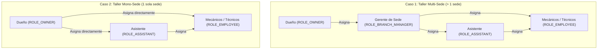
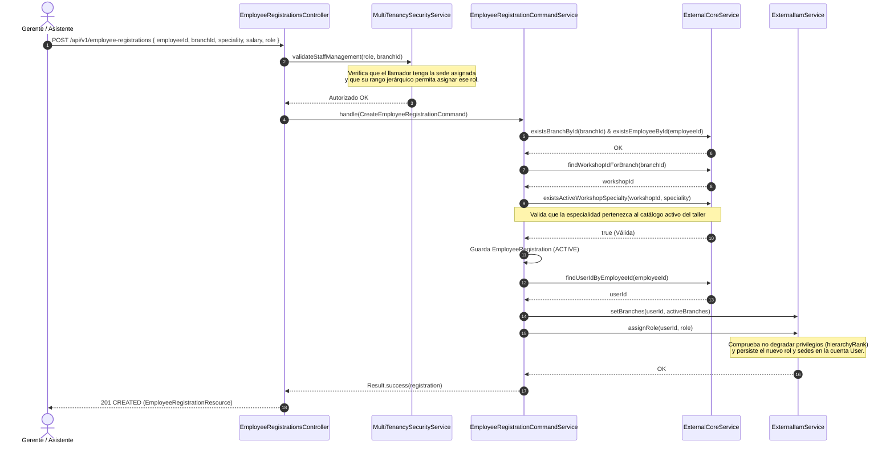

# 🔐 ShiftIQ Platform — Flujo de Autenticación, Jerarquía de Roles y Gestión de Personal

Guía completa de arquitectura y desarrollo sobre el ciclo de vida de autenticación, el sistema de roles jerárquicos y los flujos de vinculación de personal en **ShiftIQ Platform**.

---

## 📑 Tabla de Contenidos

1. [Visión General de Arquitectura](#-1-visión-general-de-arquitectura)
2. [Catálogo de Roles y Matriz de Jerarquía](#-2-catálogo-de-roles-y-matriz-de-jerarquía)
3. [Flujo de Inicio de Sesión y Manejo de Tokens (IAM)](#-3-flujo-de-inicio-de-sesión-y-manejo-de-tokens-iam)
   - [Inicio de Sesión Clásico (Email & Password)](#31-inicio-de-sesión-clásico)
   - [Inicio de Sesión con Google (OAuth2)](#32-inicio-de-sesión-con-google)
   - [Renovación de Sesión (Refresh Token)](#33-renovación-de-sesión-refresh-token)
   - [Cierre de Sesión (Revocación)](#34-cierre-de-sesión-revocación)
4. [Flujo Jerárquico de Contratación y Onboarding de Personal](#-4-flujo-jerárquico-de-contratación-y-onboarding-de-personal)
   - [Regla de Delegación: Caso Mono-Sede vs. Multi-Sede](#41-regla-de-delegación-caso-mono-sede-vs-multi-sede)
   - [Diagrama de Secuencia de Onboarding](#42-diagrama-de-secuencia-de-onboarding)
   - [Paso a Paso del Registro Directo](#43-paso-a-paso-del-registro-directo)
   - [Flujo de Postulación Autónoma (Request-Join & Aprobación)](#44-flujo-de-postulación-autónoma-request-join--aprobación)
5. [Aislamiento Multi-Tenant y Seguridad por Sede](#-5-aislamiento-multi-tenant-y-seguridad-por-sede)
   - [Scoping de Cuentas (`AccountBranchScopeResolver`)](#51-scoping-de-cuentas-accountbranchscoperesolver)
   - [Protección Contra Degradación de Privilegios](#52-protección-contra-degradación-de-privilegios)
   - [Sincronización Dinámica al Dar de Baja Personal](#53-sincronización-dinámica-al-dar-de-baja-personal)
6. [Integración con el Catálogo Dinámico de Especialidades](#-6-integración-con-el-catálogo-dinámico-de-especialidades)
7. [Buenas Prácticas para Clientes Frontend (Web y Mobile)](#-7-buenas-prácticas-para-clientes-frontend-web-y-mobile)

---

## 🏛️ 1. Visión General de Arquitectura

El sistema de seguridad de ShiftIQ implementa un modelo **Role-Based Access Control (RBAC)** combinado con **Tenancy Scoping** (aislamiento por Taller y Sedes):

* **Contexto IAM (`com.tuxlogic.shiftiq.platform.iam`)**: Administra credenciales, emite JWTs y resguarda los atributos de autenticación de cada cuenta (`role` y `branchIds`).
* **Contexto Core (`com.tuxlogic.shiftiq.platform.core`)**: Administra los talleres (`Workshop`), sedes (`Branch`), perfiles de personal (`Employee`) y el catálogo configurable de especialidades (`WorkshopSpecialty`).
* **Contexto Fleet (`com.tuxlogic.shiftiq.platform.fleet`)**: Gestiona los contratos y vinculaciones operativas de personal en sedes (`EmployeeRegistration`), orquestando la asignación real de roles a través de puertos de salida ACL (`ExternalIamService`).
* **Capa Compartida (`com.tuxlogic.shiftiq.platform.shared.infrastructure.security`)**: [`MultiTenancySecurityService`](file:///home/aldo/Proyectos/University/Mobile-Applications/shiftiq-platform/src/main/java/com/tuxlogic/shiftiq/platform/shared/infrastructure/security/MultiTenancySecurityService.java) intercepta y valida que cada operación respete la jerarquía de mando y el aislamiento territorial de sedes.

```
       ┌────────────────────────┐
       │   Cliente (Web / App)   │
       └───────────┬────────────┘
                   │ 1. POST /api/v1/authentication/sessions
                   ▼
       ┌────────────────────────┐       2. Emite JWT con claims
       │      Contexto IAM      │───────►  (id, role, branchIds)
       └───────────┬────────────┘
                   │
                   │ 3. Peticiones con Bearer <token>
                   ▼
┌───────────────────────────────────────────────┐
│         MultiTenancySecurityService           │
│  - ¿El llamador tiene la sede asignada?       │
│  - ¿Su rango jerárquico permite dar el alta?  │
└──────────────────────┬────────────────────────┘
                       │ Petición Autorizada
                       ▼
┌───────────────────────────────────────────────┐
│          Fleet / Core Controllers             │
│  - Valida especialidad en catálogo de taller   │
│  - Crea EmployeeRegistration                  │
│  - Actualiza IAM: branches & role sin degradar │
└───────────────────────────────────────────────┘
```

---

## 👑 2. Catálogo de Roles y Matriz de Jerarquía

Cada cuenta de usuario posee un rol único principal definido en el enum [`Roles`](file:///home/aldo/Proyectos/University/Mobile-Applications/shiftiq-platform/src/main/java/com/tuxlogic/shiftiq/platform/iam/domain/model/valueobjects/Roles.java):

| Rol | Rango (`hierarchyRank`) | Descripción y Responsabilidad |
| :--- | :---: | :--- |
| **`ROLE_ADMIN`** | **4** | Administrador global de la plataforma ShiftIQ. Acceso irrestricto sin filtrado de sedes. |
| **`ROLE_OWNER`** | **3** | Dueño o representante legal del taller/empresa. Gestiona talleres, sedes y personal superior. |
| **`ROLE_BRANCH_MANAGER`** | **2** | Gerente de Sede. Responsable administrativo y operativo asignado a una o más sedes específicas. |
| **`ROLE_ASSISTANT`** | **1** | Asistente de Sede / Recepcionista. Gestiona citas, recepción y alta de técnicos en su sede. |
| **`ROLE_EMPLOYEE`** | **0** | Personal técnico/operativo (Mecánico, Electricista, Planchador, Diagnóstico, etc.). |
| **`ROLE_USER`** | **0** | Cliente particular o usuario base registrado en la app móvil antes de ser contratado. |

### Matriz de Autorización para Gestión de Personal (`canManageStaff`)

La política definida en [`MultiTenancySecurityService.canManageStaff`](file:///home/aldo/Proyectos/University/Mobile-Applications/shiftiq-platform/src/main/java/com/tuxlogic/shiftiq/platform/shared/infrastructure/security/MultiTenancySecurityService.java#L256-L303) aplica las siguientes reglas estrictas:

| Rol del Llamador | Rol que Puede Dar de Alta | Restricción Territorial | Condición de Negocio |
| :--- | :--- | :--- | :--- |
| **`ROLE_ADMIN`** | Cualquier rol (`BRANCH_MANAGER`, `ASSISTANT`, `EMPLOYEE`) | Cualquiera | Modo soporte/administración global. |
| **`ROLE_OWNER`** | **`ROLE_BRANCH_MANAGER`** | Sedes de su taller | **Taller Multi-Sede** (debe delegar en gerentes). |
| **`ROLE_OWNER`** | **`ROLE_ASSISTANT`** o **`ROLE_EMPLOYEE`** | Sedes de su taller | **Taller Mono-Sede** (el dueño asume el rol de gerente). |
| **`ROLE_BRANCH_MANAGER`** | **`ROLE_ASSISTANT`** o **`ROLE_EMPLOYEE`** | Solo en sus sedes asignadas | Debe pertenecer a la sede indicada. |
| **`ROLE_ASSISTANT`** | **`ROLE_EMPLOYEE`** exclusivamente | Solo en sus sedes asignadas | Alta de mecánicos, electricistas, etc. |
| **`ROLE_EMPLOYEE`** | *Ninguno* | N/A | No tiene privilegios para dar de alta personal. |

---

## 🔑 3. Flujo de Inicio de Sesión y Manejo de Tokens (IAM)

### 3.1. Inicio de Sesión Clásico

Permite autenticar a un usuario mediante sus credenciales (correo electrónico y contraseña).

* **Endpoint:** `POST /api/v1/authentication/sessions`
* **Acceso:** Público
* **Request Body:**
```json
{
  "email": "gerente.norte@taller-rapido.com",
  "password": "Password123!"
}
```
* **Respuesta Exitosa (`200 OK`):**
```json
{
  "id": "7f8b8941-8f55-46f3-9d11-536cf29d1c7a",
  "email": "gerente.norte@taller-rapido.com",
  "role": "ROLE_BRANCH_MANAGER",
  "token": "eyJhbGciOiJIUzI1NiIsInR5cCI6IkpXVCJ9.ey...",
  "refreshToken": "84d56f61-b4d2-43cf-a0e2-66b97621c0ea",
  "accessTokenExpiresInSeconds": 900
}
```

> **Contenido del Access Token (JWT):**
> El JWT emitido incluye en sus claims el identificador del usuario (`sub`), su rol activo (`role`) y el conjunto de identificadores de sedes asignadas (`branchIds`). Esto permite a la plataforma validar accesos de forma stateless a nivel de red sin consultar la base de datos en cada petición.

---

### 3.2. Inicio de Sesión con Google

Permite autenticación federada mediante OAuth2 ID Tokens emitidos por Google Identity Services. Si el usuario no existe en la base de datos, se auto-registra con el rol por defecto `ROLE_USER`.

* **Endpoint:** `POST /api/v1/authentication/sessions/google`
* **Acceso:** Público
* **Request Body:**
```json
{
  "idToken": "eyJhbGciOiJSUzI1NiIsImtpZCI6IjEyMy... (Google JWT)"
}
```
* **Respuesta Exitosa (`200 OK`):** Retorna `AuthenticatedUserResource`.

---

### 3.3. Renovación de Sesión (Refresh Token)

Cuando el token de acceso expira (`401 Unauthorized`), el cliente frontend renueva las credenciales automáticamente usando el `refreshToken` sin obligar al usuario a escribir su clave nuevamente.

* **Endpoint:** `POST /api/v1/authentication/sessions/refresh`
* **Acceso:** Público
* **Request Body:**
```json
{
  "refreshToken": "84d56f61-b4d2-43cf-a0e2-66b97621c0ea"
}
```
* **Respuesta Exitosa (`200 OK`):** Retorna un nuevo par `token` y `refreshToken`.

> [!IMPORTANT]
> **Actualización de Roles en Sesión Activa:**
> Debido a que las autoridades (`role` y `branchIds`) se firman dentro del JWT en el momento del login, **cuando un empleado recibe un nuevo rol o una nueva sede en el backend**, deberá refrescar su sesión o iniciar sesión de nuevo para que el frontend reciba el token actualizado con los nuevos permisos.

---

### 3.4. Cierre de Sesión (Revocación)

Invalida la sesión activa y elimina el refresh token de la base de datos para impedir renovaciones posteriores.

* **Endpoint:** `DELETE /api/v1/authentication/sessions`
* **Request Body:**
```json
{
  "refreshToken": "84d56f61-b4d2-43cf-a0e2-66b97621c0ea"
}
```
* **Respuesta Exitosa (`204 NO CONTENT`)**

---

## 👥 4. Flujo Jerárquico de Contratación y Onboarding de Personal

### 4.1. Regla de Delegación: Caso Mono-Sede vs. Multi-Sede

El sistema se adapta automáticamente a la escala y estructura organizativa del taller:



---

### 4.2. Diagrama de Secuencia de Onboarding

A continuación se muestra la secuencia completa que ocurre cuando una autoridad da de alta a un miembro del personal:



---

### 4.3. Paso a Paso del Registro Directo

Para registrar a un empleado y asignarle su rol en una sede:

* **Endpoint:** `POST /api/v1/employee-registrations`
* **Cabecera requerida:** `Authorization: Bearer <token_del_jefe>`
* **Request Body:**
```json
{
  "employeeId": "a1b2c3d4-e5f6-7a8b-9c0d-1e2f3a4b5c6d",
  "branchId": "e2f3a4b5-c6d7-8e9f-0a1b-2c3d4e5f6a7b",
  "speciality": "GENERAL_MECHANIC",
  "specialityName": "Mecánico Automotriz Senior",
  "salary": 3200.00,
  "role": "ROLE_EMPLOYEE"
}
```

#### Parámetros del Body:
* `employeeId` *(UUID, Requerido)*: ID del perfil de empleado registrado previamente en el Core (`POST /api/v1/employees`).
* `branchId` *(UUID, Requerido)*: ID de la sede a la que se incorpora.
* `speciality` *(String, Requerido)*: Código en mayúsculas de una especialidad activa del catálogo del taller (ej. `GENERAL_MECHANIC`, `ELECTRICIAN`, `BODYWORK_PAINT`, etc.).
* `specialityName` *(String, Opcional)*: Título descriptivo o cargo específico dentro del taller.
* `salary` *(BigDecimal, Requerido)*: Salario asignado.
* `role` *(String, Opcional)*: Rol asignado en el sistema IAM. Acepta con o sin prefijo `ROLE_`:
  * `"ROLE_BRANCH_MANAGER"` (Gerente de Sede).
  * `"ROLE_ASSISTANT"` (Asistente de Sede).
  * `"ROLE_EMPLOYEE"` (Técnico / Operativo — valor por defecto si se omite).

* **Respuesta Exitosa (`201 CREATED`):**
```json
{
  "id": "f5e4d3c2-b1a0-9f8e-7d6c-5b4a3f2e1d0c",
  "employeeId": "a1b2c3d4-e5f6-7a8b-9c0d-1e2f3a4b5c6d",
  "branchId": "e2f3a4b5-c6d7-8e9f-0a1b-2c3d4e5f6a7b",
  "speciality": "GENERAL_MECHANIC",
  "specialityName": "Mecánico Automotriz Senior",
  "salary": 3200.00,
  "status": "ACTIVE",
  "createdAt": "2026-10-07T14:30:00Z"
}
```

---

### 4.4. Flujo de Postulación Autónoma (Request-Join & Aprobación)

Este flujo se utiliza cuando un mecánico registrado en la aplicación móvil solicita unirse por iniciativa propia a una sede:

```
1. Mecánico (ROLE_EMPLOYEE)
   POST /api/v1/employee-registrations/request-join
   { branchId, employeeId, speciality, specialityName, salary }
               │
               ▼
   Estado: PENDING_APPROVAL (No se otorgan permisos ni acceso aún)
               │
2. Encargado de Sede (ROLE_BRANCH_MANAGER / ROLE_OWNER)
   POST /api/v1/employee-registrations/{id}/approve
               │
               ▼
   Estado: ACTIVE
   - La cuenta de usuario recibe la sede en user.branchIds
   - Se le asigna formalmente el rol ROLE_EMPLOYEE en IAM
```

---

## 🛡️ 5. Aislamiento Multi-Tenant y Seguridad por Sede

### 5.1. Scoping de Cuentas (`AccountBranchScopeResolver`)

Para evitar que un Gerente de Sede o un Asistente consulte o manipule perfiles de empleados o clientes de otros talleres o sedes no autorizadas:

1. El componente [`AccountBranchScopeResolverImpl`](file:///home/aldo/Proyectos/University/Mobile-Applications/shiftiq-platform/src/main/java/com/tuxlogic/shiftiq/platform/iam/infrastructure/security/AccountBranchScopeResolverImpl.java) recupera las sedes del usuario objetivo (`targetUser.getBranchIds()`).
2. [`MultiTenancySecurityService.sharesBranchWith`](file:///home/aldo/Proyectos/University/Mobile-Applications/shiftiq-platform/src/main/java/com/tuxlogic/shiftiq/platform/shared/infrastructure/security/MultiTenancySecurityService.java#L117-L129) evalúa la intersección entre las sedes del llamador y las sedes del usuario consultado:
   $$\text{callerBranches} \cap \text{targetBranches} \neq \emptyset$$
3. Si no comparten al menos una sede, la plataforma arroja **`403 FORBIDDEN`**.

---

### 5.2. Protección Contra Degradación de Privilegios

La lógica de negocio implementada en [`Roles.canBeReplacedBy`](file:///home/aldo/Proyectos/University/Mobile-Applications/shiftiq-platform/src/main/java/com/tuxlogic/shiftiq/platform/iam/domain/model/valueobjects/Roles.java#L33-L35) e [`UserCommandServiceImpl.handle(AssignRoleToUserCommand)`](file:///home/aldo/Proyectos/University/Mobile-Applications/shiftiq-platform/src/main/java/com/tuxlogic/shiftiq/platform/iam/application/internal/commandservices/UserCommandServiceImpl.java#L163-L180) protege la integridad de las cuentas:

* Si un usuario ya es **`ROLE_BRANCH_MANAGER`** (rango 2) y posteriormente se le registra en otra sede con el rol por defecto **`ROLE_EMPLOYEE`** (rango 0):
  * **El rol NO se degrada**: La cuenta conserva `ROLE_BRANCH_MANAGER`.
  * **La nueva sede SÍ se agrega**: La nueva sede se incorpora a su conjunto de sedes autorizadas.
  * Se registra una traza de auditoría informativa (`WARN`) en el log del servidor.

---

### 5.3. Sincronización Dinámica al Dar de Baja Personal

Cuando se da de baja una vinculación de personal mediante `DELETE /api/v1/employee-registrations/{id}`:

1. El registro en Fleet pasa a estado `INACTIVE`.
2. El servicio consulta todas las vinculaciones activas restantes para ese empleado mediante `findActiveBranchIdsByEmployeeId(employeeId)`.
3. Se invoca [`ExternalIamService.setBranches`](file:///home/aldo/Proyectos/University/Mobile-Applications/shiftiq-platform/src/main/java/com/tuxlogic/shiftiq/platform/fleet/application/outboundservices/ExternalIamService.java#L23) para actualizar `User.replaceBranches()`.
4. Si el usuario ya no cuenta con ningún contrato activo en ninguna sede, su conjunto de sedes queda vacío (`[]`), perdiendo de inmediato el acceso a los datos operativos del taller.

---

## 🔧 6. Integración con el Catálogo Dinámico de Especialidades

Cada taller gestiona un catálogo propio y dinámico de especialidades técnicas que alimenta el alta de mecánicos:

* **Siembra Inicial Automática:** Al registrar un taller (`POST /api/v1/workshops`), se siembran de forma automática e idempotente 5 especialidades base:
  1. `GENERAL_MECHANIC` — *Mecánica General*
  2. `ELECTRICIAN` — *Electricidad y Electrónica*
  3. `BODYWORK_PAINT` — *Planchado y Pintura*
  4. `DIAGNOSTIC` — *Diagnóstico Computarizado*
  5. `TIRE_ALIGNMENT` — *Alineación y Suspensión*
* **Gestión por Taller:** El dueño y los gerentes de sede pueden consultar, crear, modificar o desactivar especialidades mediante los endpoints `/api/v1/workshops/{workshopId}/specialties`.
* **Validación en Onboarding:** Cualquier intento de registrar a un empleado o enviar un `request-join` con una especialidad que no esté activa en el catálogo del taller del que depende la sede es rechazado con:
  * **Código HTTP:** `400 Bad Request`
  * **Clave de Error:** `fleet.error.employeeRegistration.specialtyNotInCatalog`

---

## 📱 7. Buenas Prácticas para Clientes Frontend (Web y Mobile)

1. **Almacenamiento Seguro de Tokens:**
   * En Web: almacenar el `refreshToken` en una cookie `HttpOnly` o en memoria segura del cliente.
   * En Mobile (Flutter/React Native): almacenar el `token` y `refreshToken` en almacenamiento seguro (`flutter_secure_storage` / Keychain / Keystore).
2. **Interceptor HTTP (Axios / Dio):**
   * Configurar un interceptor que capture respuestas con código `401 Unauthorized`.
   * Encolar las peticiones fallidas, invocar `POST /api/v1/authentication/sessions/refresh` con el `refreshToken`, y reintentar las peticiones originales con el nuevo `token`.
3. **Refresco tras Asignación de Roles:**
   * Si una pantalla administrativa cambia el rol o las sedes de un usuario que tiene sesión iniciada, instruir a la aplicación para renovar la sesión vía `/sessions/refresh` para sincronizar los nuevos claims de inmediato.
4. **Validación Previa en Formularios:**
   * Al registrar un empleado, consultar previamente `GET /api/v1/workshops/{workshopId}/specialties?activeOnly=true` para poblar el dropdown de especialidades con opciones válidas.
   * Limitar las opciones del selector de rol según el rol del usuario conectado (por ejemplo, ocultar la opción `ROLE_BRANCH_MANAGER` si el usuario en sesión es un `ROLE_ASSISTANT`).
