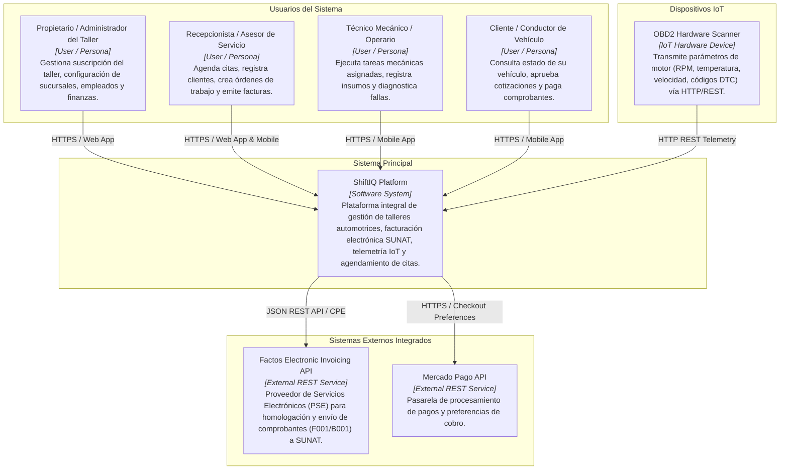
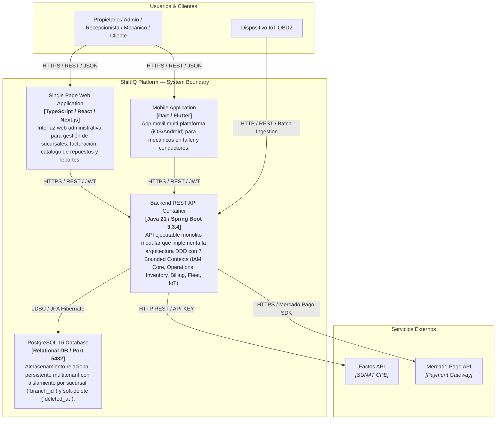

# C4 Model Software Architecture — ShiftIQ Platform (System Context, Containers & Components)

Este documento define la arquitectura global de **ShiftIQ Platform** utilizando el modelo **C4 (Context, Containers, Components, Code)** para estructurar y comunicar la visión del sistema en múltiples niveles de abstracción.

---

## 1. C4 Model — Level 1: System Context Diagram (Diagrama de Contexto del Sistema)

El Diagrama de Contexto ubica a **ShiftIQ Platform** en el centro de su ecosistema, identificando los actores humanos (usuarios del taller automotriz y clientes finales), los dispositivos de telemetría IoT y las integraciones con sistemas externos de facturación electrónica y pasarelas de pago.

### 📋 Descripción de Componentes de Contexto
- **ShiftIQ Platform**: Sistema central de software que encapsula la lógica de negocio multitenant para la gestión automotriz.
- **Factos API**: Servicio externo para emisión y envío de comprobantes electrónicos (Boletas `B001` y Facturas `F001`) a la SUNAT.
- **Mercado Pago API**: Pasarela para el cobro con tarjetas de crédito/débito y pasarela de pago en línea.
- **OBD2 Hardware Scanner**: Escáner telemático físicamente conectado al puerto OBD-II del vehículo para streaming de datos de motor.

---

## 2. C4 Model — Level 2: Container Diagram (Diagrama de Contenedores)

El Diagrama de Contenedores descompone el sistema **ShiftIQ Platform** en sus ejecutables/aplicaciones principales (Web, Mobile, Backend API, Base de Datos Relacional) y define las tecnologías y protocolos de comunicación utilizados entre ellos.

### 📋 Descripción de Contenedores
1. **Single Page Web Application** (`TypeScript / React / Next.js`): Aplicación web responsiva para administración de sucursales, tablero de caja, cotizaciones y catálogo de inventario.
2. **Mobile Application** (`Dart / Flutter`): Aplicación nativa multiplataforma para consulta de vehículos, recepción de citas y recepción de alertas telemáticas.
3. **Backend REST API Container** (`Java 26 / Spring Boot 4.0.6`): API monolítica modular diseñada bajo Domain-Driven Design (DDD) dividida en 7 Bounded Contexts independientes.
4. **PostgreSQL 16 Database**: Almacenamiento relacional en puerto `5432` con esquema multitenant optimizado y auditoría por entidad.

---

## 3. C4 Model — Level 3: Component Diagrams Summary (Diagramas de Componentes por Bounded Context)

El **Nivel 3 (Componentes)** del modelo C4 está desglosado minuciosamente para el **Backend REST API Container** en los documentos dedicados de cada Bounded Context:

| Bounded Context | Descripción de Componentes (Nivel 3) | Documento Arquitectónico |
| :--- | :--- | :--- |
| **IAM** | AuthController, UserDetailsServiceImpl, JwtProvider, MultiTenancySecurityService | [`ddd-bounded-contexts-dictionary.md`](file:///home/aldo/Proyectos/University/Mobile-Applications/shiftiq-platform/docs/ddd-bounded-contexts-dictionary.md) |
| **Core** | CustomersController, EmployeesController, WorkshopsController, SubscriptionsController | [`core-bounded-context-dictionary.md`](file:///home/aldo/Proyectos/University/Mobile-Applications/shiftiq-platform/docs/core-bounded-context-dictionary.md) |
| **Operations** | WorkOrdersController, WorkOrderTasksController, ServicesController | [`operations-bounded-context-dictionary.md`](file:///home/aldo/Proyectos/University/Mobile-Applications/shiftiq-platform/docs/operations-bounded-context-dictionary.md) |
| **Inventory** | ProductsController, InventoryStockListener, MinimumStockAlertEvaluationJob | [`inventory-bounded-context-dictionary.md`](file:///home/aldo/Proyectos/University/Mobile-Applications/shiftiq-platform/docs/inventory-bounded-context-dictionary.md) |
| **Billing** | QuotesController, VouchersController, CheckoutsController, MercadoPagoPaymentsController, FactosGatewayImpl | [`billing-bounded-context-dictionary.md`](file:///home/aldo/Proyectos/University/Mobile-Applications/shiftiq-platform/docs/billing-bounded-context-dictionary.md) |
| **Fleet** | AppointmentsController, CustomerRegistrationsController, EmployeeRegistrationsController | [`fleet-bounded-context-dictionary.md`](file:///home/aldo/Proyectos/University/Mobile-Applications/shiftiq-platform/docs/fleet-bounded-context-dictionary.md) |
| **IoT** | VehiclesController, Obd2DevicesController, Obd2DeviceRegistrationsController, TelemetryBatchesController | [`iot-bounded-context-dictionary.md`](file:///home/aldo/Proyectos/University/Mobile-Applications/shiftiq-platform/docs/iot-bounded-context-dictionary.md) |

