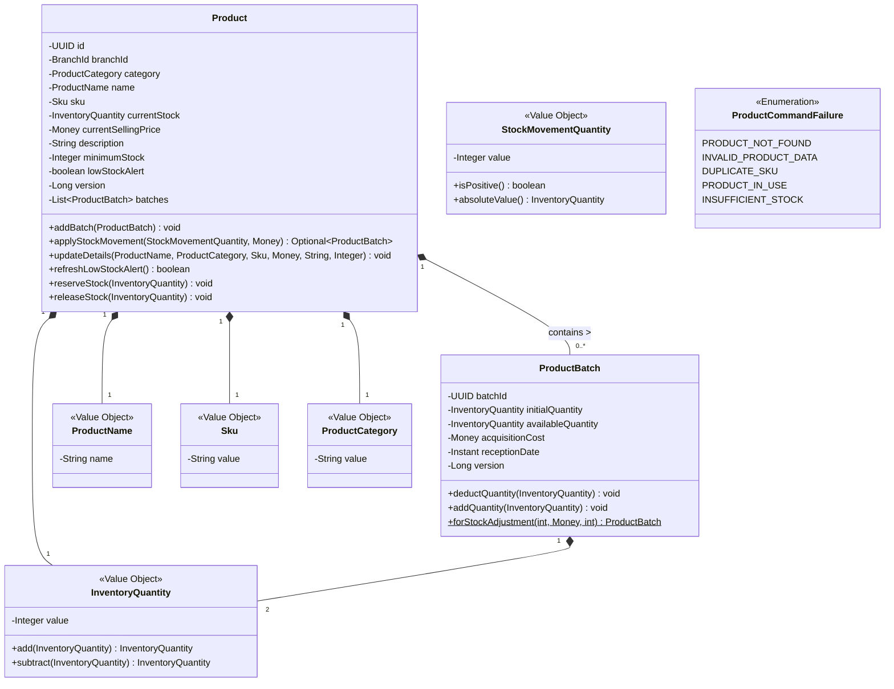
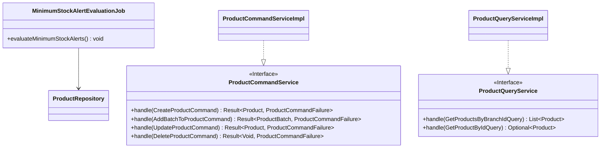
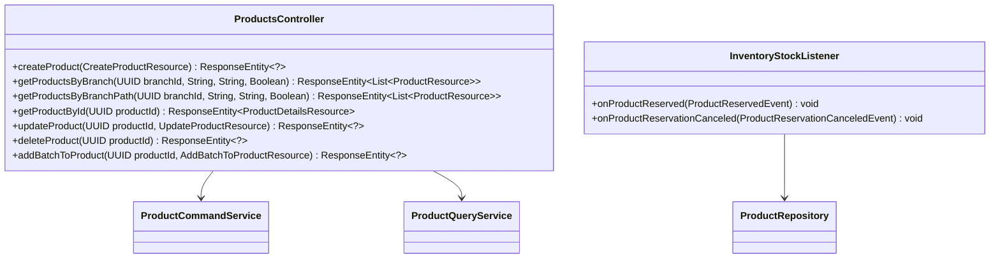
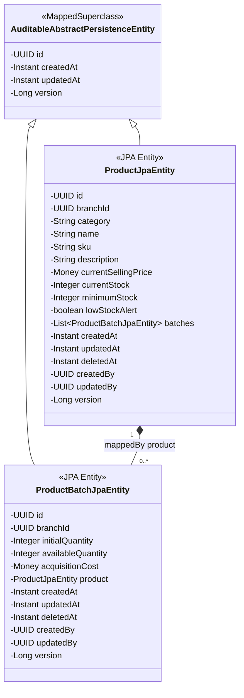
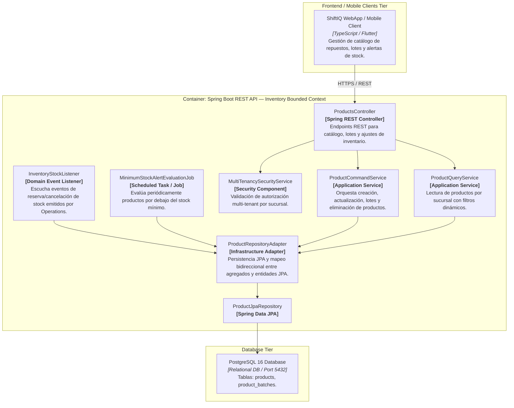
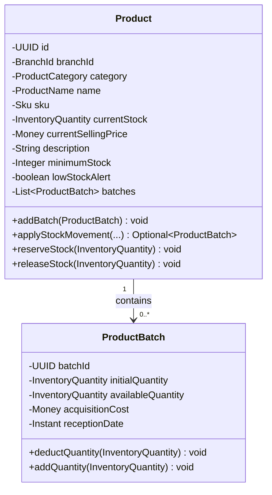

# Bounded Context Software Architecture & Domain Dictionary — Inventory (Stock & Products Management)

El **Bounded Context `Inventory`** administra el catálogo de repuestos, autopartes y consumibles del taller automotriz (`Product`), la gestión física de existencias mediante lotes de adquisición (`ProductBatch`), la evaluación automática de niveles de stock mínimo (`MinimumStockAlertEvaluationJob`), y la sincronización asíncrona de inventario respondiendo a las reservas y despachos producidos por las Órdenes de Trabajo del Bounded Context `Operations`.

---

## 1. Domain Layer (Capa de Dominio)

La Capa de Dominio define las reglas inmutables del inventario, gestionando el stock disponible, la deducción FIFO en lotes, la activación de alertas de bajo stock y las validaciones de negocio sin dependencias tecnológicas.



---

### 1.1. Value Objects, Enums & Exceptions

#### 📌 Record: `ProductName(String name)`
* **Propósito:** Nombre comercial de la autoparte o repuesto.
* **Validaciones:** No puede ser nulo ni estar en blanco (`inventory.error.productName.required`).

#### 📌 Record: `Sku(String value)`
* **Propósito:** Stock Keeping Unit (código único de producto por sucursal).
* **Validaciones:** No puede ser nulo ni estar en blanco (`inventory.error.sku.required`).

#### 📌 Record: `ProductCategory(String value)`
* **Propósito:** Categoría o familia del producto (ej. "Frenos", "Filtros", "Lubricantes").
* **Validaciones:** No puede ser nulo ni estar en blanco (`inventory.error.productCategory.required`).

#### 📌 Record: `InventoryQuantity(Integer value)`
* **Propósito:** Cantidad entera no negativa en inventario.
* **Validaciones:** No nulo y `>= 0` (`inventory.error.quantity.invalid`).
* **Métodos:**
  * `add(InventoryQuantity)`: Suma cantidades.
  * `subtract(InventoryQuantity)`: Resta cantidades; lanza `IllegalArgumentException("inventory.error.quantity.resultingNegative")` si el resultado es negativo.

#### 📌 Record: `StockMovementQuantity(Integer value)`
* **Propósito:** Representa un movimiento o ajuste de inventario (positivo para ingresos, negativo para egresos).
* **Validaciones:** No nulo y distinto de cero (`inventory.error.resource.quantity.required`, `inventory.error.resource.quantity.nonZero`).
* **Métodos:** `isPositive()`, `absoluteValue()`.

#### 📌 Enum: `ProductCommandFailure`
* **Valores:** `PRODUCT_NOT_FOUND`, `INVALID_PRODUCT_DATA`, `DUPLICATE_SKU`, `PRODUCT_IN_USE`, `INSUFFICIENT_STOCK`.

#### 📌 Excepción: `InsufficientStockException`
* Excepción de dominio lanzada cuando se intenta reservar o descontar más stock del disponible (`inventory.error.product.insufficientStock`).

---

### 1.2. Aggregates & Entities

#### 📌 Aggregate: `Product`
* **Hereda de:** `AbstractAggregateRoot<Product>`
* **Propósito:** Raíz de agregado que representa un producto del inventario de una sucursal (`BranchId`).
* **Reglas de Negocio:**
  * Mantiene una lista inmutable de lotes de ingreso (`batches`).
  * `reserveStock(InventoryQuantity amount)`: Descuenta stock recorriendo los lotes activos en orden FIFO. Lanza `InsufficientStockException` si `currentStock < amount`.
  * `releaseStock(InventoryQuantity amount)`: Reingresa stock a los lotes en caso de cancelación de reserva.
  * `refreshLowStockAlert()`: Evalúa si `currentStock <= minimumStock`. Si el estado cambia, emite `LowStockAlertTriggeredEvent` o `LowStockAlertClearedEvent`.

#### 📌 Entity: `ProductBatch`
* **Propósito:** Entidad que representa un lote físico específico recibido con costo de adquisición y fecha de recepción.
* **Atributos:** `batchId` (UUID), `initialQuantity` (InventoryQuantity), `availableQuantity` (InventoryQuantity), `acquisitionCost` (Money), `receptionDate` (Instant), `version` (Long).
* **Comportamiento:** `deductQuantity` y `addQuantity` actualizan `availableQuantity`.

---

### 1.3. Domain Events

* `ProductCreatedEvent`: Notifica la creación de un nuevo producto en una sucursal.
* `ProductUpdatedEvent`: Notifica la actualización de los datos del producto.
* `StockMovementAppliedEvent`: Notifica la aplicación de un movimiento de stock manual o lote.
* `StockReservedEvent`: Notifica la reserva exitosa de stock solicitada desde Operations.
* `StockReleasedEvent`: Notifica la liberación de stock previamente reservado.
* `LowStockAlertTriggeredEvent`: Notifica cuando el stock cae por debajo del mínimo configurado.
* `LowStockAlertClearedEvent`: Notifica cuando el stock se recupera por encima del mínimo.

---

### 1.4. Domain Repositories (Interfaces)

* `ProductRepository`:
  * `Product save(Product product)`
  * `Optional<Product> findById(UUID id)`
  * `List<Product> findAllByBranchId(BranchId branchId)`
  * `List<Product> findAllByBranchIdWithFilters(BranchId branchId, String name, String category, Boolean lowStockOnly)`
  * `List<Product> findAll()`
  * `boolean existsByBranchIdAndSku(BranchId branchId, String sku)`
  * `boolean existsByBranchIdAndSkuAndIdNot(BranchId branchId, String sku, UUID productId)`
  * `boolean existsById(UUID id)`
  * `void deleteById(UUID id)`

---

## 2. Application Layer (Capa de Aplicación)

La Capa de Aplicación expone la ejecución de casos de uso utilizando `Result<T, ProductCommandFailure>` para manejo funcional de fallos y ejecuta tareas programadas para la evaluación continua de alertas.



---

### 2.1. Commands & Queries (DTOs de Aplicación)

#### Commands
* 🟦 **`CreateProductCommand(BranchId branchId, ProductCategory category, ProductName name, Sku sku, String description, Money salePrice, InventoryQuantity minimumStock)`**
* 🟦 **`UpdateProductCommand(UUID productId, ProductName name, ProductCategory category, Sku sku, String description, Money salePrice, InventoryQuantity minimumStock)`**
* 🟦 **`DeleteProductCommand(UUID productId)`**
* 🟦 **`AddBatchToProductCommand(UUID productId, StockMovementQuantity quantity, Money acquisitionCost)`**

#### Queries
* 🟩 **`GetProductByIdQuery(UUID productId)`**
* 🟩 **`GetProductsByBranchIdQuery(BranchId branchId, String name, String category, Boolean lowStockOnly)`**

---

## 3. Interface Layer (Capa de Interfaz / REST & Events)

Exposición RESTful e integración asíncrona mediante listeners de eventos producidos por otros Bounded Contexts.



---

### 3.1. Endpoints & REST Controllers

#### 📌 `ProductsController` (`/api/v1/inventory/products`)
* `POST /api/v1/inventory/products`: Registra un nuevo producto en el inventario de una sucursal.
* `GET /api/v1/inventory/products?branchId={branchId}`: Consulta productos por sucursal con filtros opcionales de búsqueda (`name`, `category`, `lowStockOnly`).
* `GET /api/v1/inventory/products/branch/{branchId}`: Catálogo de productos por ruta de sucursal.
* `GET /api/v1/inventory/products/{productId}`: Consulta detalles completos de un producto incluyendo sus lotes.
* `PUT /api/v1/inventory/products/{productId}`: Actualiza información básica del producto.
* `DELETE /api/v1/inventory/products/{productId}`: Eliminación lógica (soft-delete vía `deleted_at`) del producto y sus lotes.
* `POST /api/v1/inventory/products/{productId}/batches`: Registra la entrada de un nuevo lote de stock o un ajuste manual de almacén.

#### 📌 Event Listener: `InventoryStockListener`
* Escucha `ProductReservedEvent` proveniente de `Operations` e invoca `product.reserveStock(amount)`.
* Escucha `ProductReservationCanceledEvent` proveniente de `Operations` e invoca `product.releaseStock(amount)`.

---

## 4. Infrastructure Layer (Capa de Infraestructura)

Mapeo ORM relacional a PostgreSQL 16 con Spring Data JPA y configuración de Jobs programados con `@EnableScheduling`.



---

### 4.1. Mapeo de Entidades Relacionales (JPA)

* **`products`** (`ProductJpaEntity`):
  * `id` (UUID, PK, heredado de `AuditableAbstractPersistenceEntity`)
  * `branch_id` (UUID, NOT NULL)
  * `category` (VARCHAR, NOT NULL)
  * `name` (VARCHAR, NOT NULL)
  * `sku` (VARCHAR, NOT NULL)
  * `description` (TEXT)
  * `current_selling_price` (DECIMAL, `MoneyAttributeConverter`)
  * `current_stock` (INTEGER, NOT NULL)
  * `minimum_stock` (INTEGER, NOT NULL)
  * `low_stock_alert` (BOOLEAN, NOT NULL)
  * `deleted_at` (TIMESTAMP), `created_by` (UUID), `updated_by` (UUID)
  * `created_at`, `updated_at`, `version` (heredados de `AuditableAbstractPersistenceEntity`)
* **`product_batches`** (`ProductBatchJpaEntity`):
  * `id` (UUID, PK, heredado de `AuditableAbstractPersistenceEntity`)
  * `product_id` (UUID, FK, NOT NULL)
  * `branch_id` (UUID, NOT NULL)
  * `initial_quantity` (INTEGER, NOT NULL)
  * `available_quantity` (INTEGER, NOT NULL)
  * `acquisition_cost` (DECIMAL, `MoneyAttributeConverter`)
  * `deleted_at` (TIMESTAMP), `created_by` (UUID), `updated_by` (UUID)
  * `created_at`, `updated_at`, `version` (heredados de `AuditableAbstractPersistenceEntity`)

---

## 5. Software Architecture Component Level Diagrams (C4 Model - Level 3)

El siguiente diagrama C4 descompone el Container API en sus componentes principales para el Bounded Context **Inventory**.



---

## 6. Code Level Diagrams

### 6.1. Domain Layer Class Diagram



---

### 6.2. PostgreSQL 16 Entity Relationship Diagram (ERD)

```mermaid
erDiagram
    branches ||--o{ products : "manages inventory"
    branches ||--o{ product_batches : "stores batch"
    products ||--e{ product_batches : "consists of"

    products {
        uuid id PK
        uuid branch_id FK
        varchar category
        varchar name
        varchar sku
        text description
        numeric current_selling_price
        integer current_stock
        integer minimum_stock
        boolean low_stock_alert
        uuid created_by
        uuid updated_by
        timestamp created_at
        timestamp updated_at
        timestamp deleted_at
        bigint version
    }

    product_batches {
        uuid id PK
        uuid product_id FK
        uuid branch_id FK
        integer initial_quantity
        integer available_quantity
        numeric acquisition_cost
        uuid created_by
        uuid updated_by
        timestamp created_at
        timestamp updated_at
        timestamp deleted_at
        bigint version
    }
```
