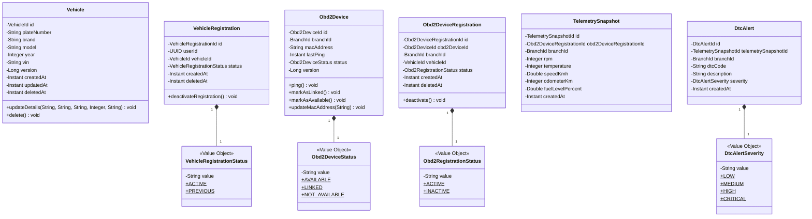
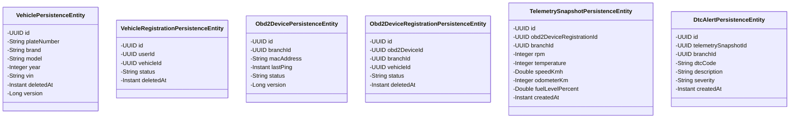
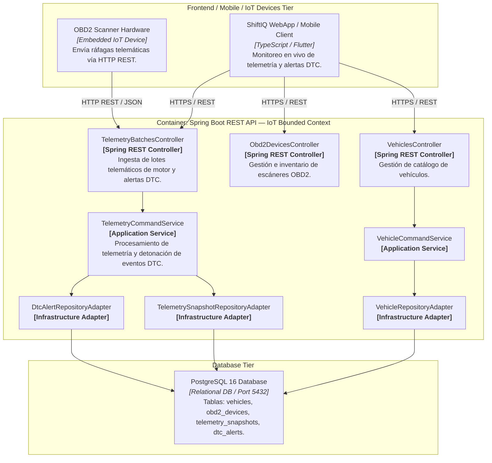
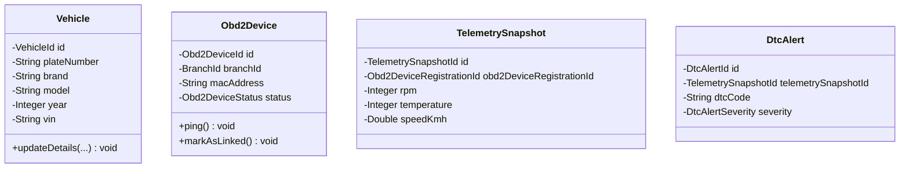
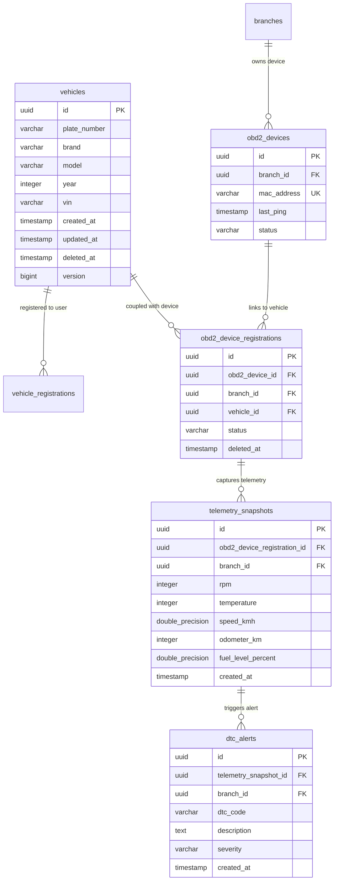

# Bounded Context Software Architecture & Domain Dictionary — IoT (Telemetry, Vehicles & OBD-II Devices)

El **Bounded Context `IoT`** administra la identidad de los vehículos (`Vehicle`), la vinculación con sus conductores/propietarios (`VehicleRegistration`), el inventario y estado operativo de escáneres telemáticos (`Obd2Device`), el emparejamiento activo entre escáneres y vehículos (`Obd2DeviceRegistration`), la ingesta masiva de capturas de telemetría vehicular en tiempo real (`TelemetrySnapshot`), y la detección e inmutabilidad de alertas de códigos de falla computarizados (`DtcAlert` / Diagnostic Trouble Codes).

---

## 1. Domain Layer (Capa de Dominio)

La Capa de Dominio rige las reglas de lectura e ingesta telemática, la vinculación inmutable de dispositivos OBD2 con vehículos, las alertas automáticas según la gravedad de los códigos DTC (p. ej. P0300, P0420) y la validación de vin/placa vehicular.

---

### 1.1. Value Objects, Enums & Exceptions

#### 📌 Record Value Object: `Obd2DeviceStatus(String value)`
* **Valores Válidos:** `AVAILABLE`, `LINKED`, `NOT_AVAILABLE`.
* **Propósito:** Representa el estado de disponibilidad física de un escáner OBD2 en la sucursal.

#### 📌 Record Value Object: `Obd2RegistrationStatus(String value)`
* **Valores Válidos:** `ACTIVE`, `INACTIVE`.
* **Propósito:** Estado del acoplamiento entre un escáner OBD2 y un vehículo.

#### 📌 Record Value Object: `VehicleRegistrationStatus(String value)`
* **Valores Válidos:** `ACTIVE`, `PREVIOUS`.
* **Propósito:** Estado de la vinculación entre un usuario conductor y un vehículo.

#### 📌 Record Value Object: `DtcAlertSeverity(String value)`
* **Valores Válidos:** `LOW`, `MEDIUM`, `HIGH`, `CRITICAL`.
* **Propósito:** Severidad del código de error de diagnóstico telemático (Diagnostic Trouble Code).

---

### 1.2. Aggregates & Entities

#### 📌 Aggregate Root: `Vehicle`
* **Hereda de:** `AbstractDomainAggregateRoot<Vehicle>`
* **Propósito:** Agregado que representa un automóvil o vehículo del parque automotor.
* **Reglas de Negocio:**
  - Valida obligatoriedad de placa, marca, modelo, VIN y año (1900 a año actual + 1).
  - Emite `VehicleDetailsUpdatedEvent` al modificar sus especificaciones.

#### 📌 Aggregate Root: `VehicleRegistration`
* **Hereda de:** `AbstractDomainAggregateRoot<VehicleRegistration>`
* **Propósito:** Enlace entre un conductor (`userId`) y un vehículo (`vehicleId`).
* **Reglas de Negocio:**
  - `deactivateRegistration()`: Cambia el estado a `PREVIOUS`, marca `deletedAt` y emite `VehicleRegistrationDeactivatedEvent`.

#### 📌 Aggregate Root: `Obd2Device`
* **Hereda de:** `AbstractDomainAggregateRoot<Obd2Device>`
* **Propósito:** Dispositivo físico de diagnóstico telemático registrado en una sucursal (`BranchId`).
* **Reglas de Negocio:**
  - `ping()`: Actualiza el timestamp de última conexión (`lastPing`).
  - `markAsLinked()`: Transiciona a `LINKED` y emite `Obd2DeviceStatusChangedEvent`.
  - `markAsAvailable()`: Transiciona a `AVAILABLE`.

#### 📌 Aggregate Root: `Obd2DeviceRegistration`
* **Hereda de:** `AbstractDomainAggregateRoot<Obd2DeviceRegistration>`
* **Propósito:** Emparejamiento activo entre un escáner OBD2 y un vehículo en una sucursal.
* **Reglas de Negocio:**
  - `deactivate()`: Cambia estado a `INACTIVE`, marca `deletedAt` y emite `Obd2DeviceRegistrationDeactivatedEvent`.

#### 📌 Aggregate Root: `TelemetrySnapshot`
* **Hereda de:** `AbstractDomainAggregateRoot<TelemetrySnapshot>`
* **Propósito:** Captura puntual e inmutable de parámetros de motor (RPM, temperatura, velocidad km/h, odómetro, nivel de combustible %).

#### 📌 Aggregate Root: `DtcAlert`
* **Hereda de:** `AbstractDomainAggregateRoot<DtcAlert>`
* **Propósito:** Alerta de falla computarizada generada por el escáner (código DTC, descripción y severidad).
* **Reglas de Negocio:**
  - Al instanciarse durante la ingesta telemática, emite `DtcAlertTriggeredEvent`.

---

### 1.3. Domain Events

* `VehicleDetailsUpdatedEvent`: Notifica actualización de datos de un vehículo.
* `VehicleRegistrationDeactivatedEvent`: Notifica desvinculación de un conductor con un vehículo.
* `Obd2DeviceStatusChangedEvent`: Notifica cambios de estado de un escáner OBD2 (AVAILABLE / LINKED).
* `Obd2DeviceRegistrationDeactivatedEvent`: Notifica la desvinculación de un escáner OBD2 de un vehículo.
* `DtcAlertTriggeredEvent`: Notifica la detección de una falla telemática DTC en tiempo real.

---

### 1.4. Domain Repositories (Interfaces)

* `VehicleRepository`:
  * `Vehicle save(Vehicle vehicle)`
  * `Optional<Vehicle> findById(VehicleId id)`
  * `Optional<Vehicle> findByVin(String vin)`
  * `Optional<Vehicle> findByPlateNumber(String plateNumber)`
  * `List<Vehicle> findAll()`

* `Obd2DeviceRepository`:
  * `Obd2Device save(Obd2Device device)`
  * `Optional<Obd2Device> findById(Obd2DeviceId id)`
  * `Optional<Obd2Device> findByMacAddress(String macAddress)`
  * `List<Obd2Device> findByBranchId(BranchId branchId)`

* `Obd2DeviceRegistrationRepository`:
  * `Obd2DeviceRegistration save(Obd2DeviceRegistration registration)`
  * `Optional<Obd2DeviceRegistration> findById(Obd2DeviceRegistrationId id)`
  * `Optional<Obd2DeviceRegistration> findByVehicleIdAndStatus(VehicleId vehicleId, Obd2RegistrationStatus status)`

* `TelemetrySnapshotRepository`:
  * `TelemetrySnapshot save(TelemetrySnapshot snapshot)`
  * `Optional<TelemetrySnapshot> findLatestByRegistrationId(Obd2DeviceRegistrationId registrationId)`

* `DtcAlertRepository`:
  * `DtcAlert save(DtcAlert alert)`
  * `List<DtcAlert> findBySnapshotId(TelemetrySnapshotId snapshotId)`

---

## 2. Application Layer (Capa de Aplicación)

La Capa de Aplicación expone la ingesta de telemetría y gestión de dispositivos telemáticos mediante servicios de comando y consulta.

```mermaid
classDiagram
    direction TB

    class VehicleCommandService {
        <<Interface>>
        +handle(RegisterVehicleCommand) Result~Vehicle, VehicleCommandFailure~
        +handle(UpdateVehicleCommand) Result~Vehicle, VehicleCommandFailure~
        +handle(DeleteVehicleCommand) Result~VehicleId, VehicleCommandFailure~
    }

    class VehicleQueryService {
        <<Interface>>
        +handle(GetVehicleByIdQuery) Result~Vehicle, VehicleQueryFailure~
        +handle(GetVehicleByVinQuery) Result~Vehicle, VehicleQueryFailure~
        +handle(GetVehicleByPlateNumberQuery) Result~Vehicle, VehicleQueryFailure~
    }

    class Obd2DeviceCommandService {
        <<Interface>>
        +handle(CreateObd2DeviceCommand) Result~Obd2Device, Obd2DeviceCommandFailure~
        +handle(UpdateObd2DeviceCommand) Result~Obd2Device, Obd2DeviceCommandFailure~
        +handle(PingObd2DeviceCommand) Result~Obd2Device, Obd2DeviceCommandFailure~
    }

    class TelemetryCommandService {
        <<Interface>>
        +handle(IngestTelemetryBatchCommand) Result~TelemetrySnapshot, TelemetryCommandFailure~
    }

    class TelemetryQueryService {
        <<Interface>>
        +handle(GetLatestTelemetrySnapshotQuery) Result~TelemetrySnapshot, TelemetryQueryFailure~
        +handle(GetDtcAlertsByVehicleQuery) Result~List~DtcAlert~, TelemetryQueryFailure~
    }
```

---

### 2.1. Commands & Queries (DTOs de Aplicación)

#### Commands
* 🟦 **`RegisterVehicleCommand(String plateNumber, String brand, String model, Integer year, String vin)`**
* 🟦 **`UpdateVehicleCommand(VehicleId vehicleId, String plateNumber, String brand, String model, Integer year, String vin)`**
* 🟦 **`DeleteVehicleCommand(VehicleId vehicleId)`**
* 🟦 **`CreateObd2DeviceCommand(BranchId branchId, String macAddress)`**
* 🟦 **`UpdateObd2DeviceCommand(Obd2DeviceId obd2DeviceId, String macAddress)`**
* 🟦 **`LinkObd2DeviceCommand(Obd2DeviceId obd2DeviceId, BranchId branchId, VehicleId vehicleId)`**
* 🟦 **`UnlinkObd2DeviceCommand(Obd2DeviceRegistrationId registrationId)`**
* 🟦 **`IngestTelemetryBatchCommand(String macAddress, Integer rpm, Integer temperature, Double speedKmh, Integer odometerKm, Double fuelLevelPercent, List<String> dtcCodes)`**

#### Queries
* 🟩 **`GetVehicleByIdQuery(VehicleId vehicleId)`**
* 🟩 **`GetVehicleByVinQuery(String vin)`**
* 🟩 **`GetVehicleByPlateNumberQuery(String plateNumber)`**
* 🟩 **`GetObd2DevicesByBranchIdQuery(BranchId branchId)`**
* 🟩 **`GetLatestTelemetrySnapshotQuery(VehicleId vehicleId)`**
* 🟩 **`GetDtcAlertsByVehicleQuery(VehicleId vehicleId)`**

---

## 3. Interface Layer (Capa de Interfaz / REST)

Exposición RESTful para ingesta telemática, alertas de motor y dispositivos OBD2.

```mermaid
classDiagram
    direction TB

    class VehiclesController {
        +registerVehicle(RegisterVehicleResource) ResponseEntity~?~
        +getVehicle(UUID, String, String) ResponseEntity~?~
        +updateVehicle(UUID, UpdateVehicleResource) ResponseEntity~?~
        +deleteVehicle(UUID) ResponseEntity~?~
    }

    class CustomerVehiclesController {
        +registerCustomerVehicle(UUID, RegisterVehicleResource) ResponseEntity~?~
        +getCustomerVehicles(UUID) ResponseEntity~?~
        +unlinkCustomerVehicle(UUID, UUID) ResponseEntity~?~
    }

    class Obd2DevicesController {
        +createDevice(CreateObd2DeviceResource) ResponseEntity~?~
        +getDevicesByBranch(UUID) ResponseEntity~?~
        +updateDevice(UUID, UpdateObd2DeviceResource) ResponseEntity~?~
        +ping(UUID) ResponseEntity~?~
    }

    class TelemetryBatchesController {
        +ingestBatch(IngestTelemetryBatchResource) ResponseEntity~?~
        +getLatestSnapshot(UUID) ResponseEntity~?~
        +getDtcAlerts(UUID) ResponseEntity~?~
    }

    VehiclesController --> VehicleCommandService
    VehiclesController --> VehicleQueryService
    Obd2DevicesController --> Obd2DeviceCommandService
    TelemetryBatchesController --> TelemetryCommandService
    TelemetryBatchesController --> TelemetryQueryService
```

---

### 3.1. Endpoints & REST Controllers

#### 📌 `VehiclesController` (`/api/v1/vehicles`)
* `POST /api/v1/vehicles`: Registra un nuevo vehículo en el catálogo telemático.
* `GET /api/v1/vehicles`: Consulta vehículos por ID, VIN o placa.
* `PUT /api/v1/vehicles/{vehicleId}`: Actualiza especificaciones del vehículo.
* `DELETE /api/v1/vehicles/{vehicleId}`: Eliminación lógica (soft-delete).

#### 📌 `CustomerVehiclesController` (`/api/v1/customers/{customerId}/vehicles`)
* `POST /api/v1/customers/{customerId}/vehicles`: Registra y vincula un vehículo a un cliente.
* `GET /api/v1/customers/{customerId}/vehicles`: Consulta los vehículos propiedad de un cliente.
* `DELETE /api/v1/customers/{customerId}/vehicles/{vehicleId}`: Desvincula la propiedad del vehículo.

#### 📌 `Obd2DevicesController` (`/api/v1/obd2-devices`)
* `POST /api/v1/obd2-devices`: Registra un nuevo escáner OBD2 en una sucursal.
* `GET /api/v1/obd2-devices?branchId={branchId}`: Lista escáneres asignados a una sucursal.
* `PUT /api/v1/obd2-devices/{obd2DeviceId}`: Actualiza la dirección MAC del escáner.
* `POST /api/v1/obd2-devices/{obd2DeviceId}/ping`: Registra el pulso de conexión (*heartbeat*).

#### 📌 `TelemetryBatchesController` (`/api/v1/telemetry-batches`)
* `POST /api/v1/telemetry-batches`: Ingesta remota de lote telemático procedente del escáner OBD2 (RPM, velocidad, temperatura y fallas DTC).
* `GET /api/v1/telemetry-batches/{vehicleId}/latest`: Obtiene la última instantánea telemática del vehículo.
* `GET /api/v1/telemetry-batches/{vehicleId}/alerts`: Obtiene el historial de alertas DTC de falla del vehículo.

---

## 4. Infrastructure Layer (Capa de Infraestructura)

Mapeo relacional JPA a PostgreSQL 16 con soporte de eliminación lógica.

---

### 4.1. Mapeo de Entidades Relacionales (JPA)

* **`vehicles`** (`VehiclePersistenceEntity`):
  * `id` (UUID, PK, heredado de `AuditableAbstractPersistenceEntity`)
  * `plate_number` (VARCHAR(20), NOT NULL)
  * `brand` (VARCHAR(50), NOT NULL)
  * `model` (VARCHAR(50), NOT NULL)
  * `year` (INTEGER, NOT NULL)
  * `vin` (VARCHAR(50), NOT NULL)
  * `deleted_at` (TIMESTAMP)
  * `created_at`, `updated_at`, `version` (heredados)
* **`vehicle_registrations`** (`VehicleRegistrationPersistenceEntity`):
  * `id` (UUID, PK, heredado de `AuditableAbstractPersistenceEntity`)
  * `user_id` (UUID, NOT NULL)
  * `vehicle_id` (UUID, NOT NULL)
  * `status` (VARCHAR(20), NOT NULL)
  * `deleted_at` (TIMESTAMP)
* **`obd2_devices`** (`Obd2DevicePersistenceEntity`):
  * `id` (UUID, PK, heredado de `AuditableAbstractPersistenceEntity`)
  * `branch_id` (UUID, NOT NULL)
  * `mac_address` (VARCHAR(50), NOT NULL, UNIQUE)
  * `last_ping` (TIMESTAMP)
  * `status` (VARCHAR(20), NOT NULL)
* **`obd2_device_registrations`** (`Obd2DeviceRegistrationPersistenceEntity`):
  * `id` (UUID, PK, heredado de `AuditableAbstractPersistenceEntity`)
  * `obd2_device_id` (UUID, NOT NULL)
  * `branch_id` (UUID, NOT NULL)
  * `vehicle_id` (UUID, NOT NULL)
  * `status` (VARCHAR(20), NOT NULL)
  * `deleted_at` (TIMESTAMP)
* **`telemetry_snapshots`** (`TelemetrySnapshotPersistenceEntity`):
  * `id` (UUID, PK)
  * `obd2_device_registration_id` (UUID, NOT NULL)
  * `branch_id` (UUID, NOT NULL)
  * `rpm` (INTEGER), `temperature` (INTEGER), `speed_kmh` (DOUBLE PRECISION), `odometer_km` (INTEGER), `fuel_level_percent` (DOUBLE PRECISION)
  * `created_at` (TIMESTAMP)
* **`dtc_alerts`** (`DtcAlertPersistenceEntity`):
  * `id` (UUID, PK)
  * `telemetry_snapshot_id` (UUID, NOT NULL)
  * `branch_id` (UUID, NOT NULL)
  * `dtc_code` (VARCHAR(20), NOT NULL)
  * `description` (TEXT)
  * `severity` (VARCHAR(20), NOT NULL)
  * `created_at` (TIMESTAMP)

---

## 5. Software Architecture Component Level Diagrams (C4 Model - Level 3)

Descomposición del Container API en sus componentes principales para el Bounded Context **IoT**.

---

## 6. Code Level Diagrams

### 6.1. Domain Layer Class Diagram

---

### 6.2. PostgreSQL 16 Entity Relationship Diagram (ERD)

