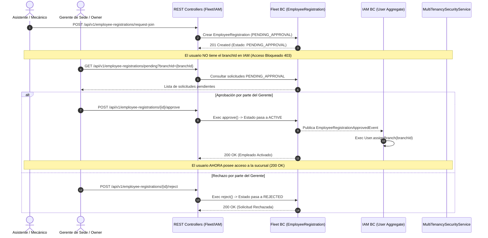
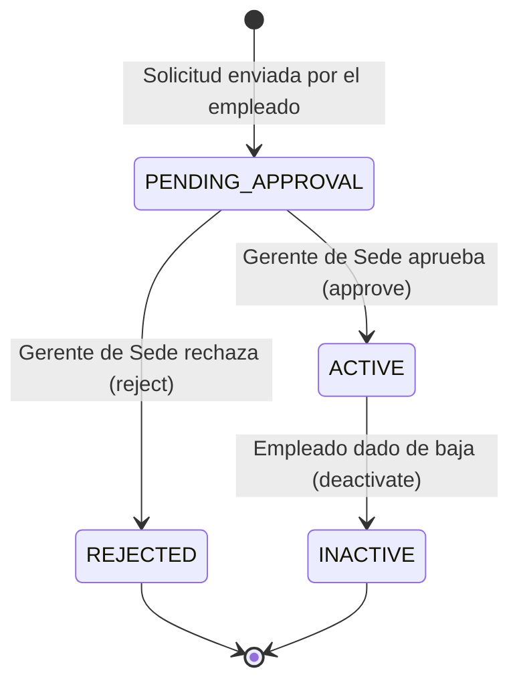

# Especificación de Arquitectura & User Story — Flujo de Invitación, Solicitud y Aprobación de Empleados (`Fleet` & `IAM`)

**ID de la Historia de Usuario:** `US038`  
**Épica Relacionada:** `EP001` (Gestión de Identidad, Usuarios y Accesos) / `EP006` (Arquitectura & RESTful API)  
**Bounded Contexts Involucrados:** `Fleet` (Adscripciones y Citas) ➔ `IAM` (Usuarios y Permisos Multi-Tenant)  

---

## 1. Resumen Ejecutivo & Contexto de Negocio

En cadenas de talleres automotrices con múltiples sedes (`Branch`), el **Dueño del Taller (`ROLE_OWNER`)** delega la administración diaria en los **Gerentes de Sucursal**. 

Para evitar la carga manual de datos por parte del dueño y prevenir que usuarios no autorizados se auto-adscriban a una sucursal ajena, se especifica el **Flujo de Solicitud de Ingreso y Aprobación Descentralizada de Empleados**.



---

## 2. Definición de la Historia de Usuario (`US038`)

**Como** Gerente de Sucursal o Dueño de Taller,  
**Quiero** revisar y aprobar las solicitudes de incorporación de asistentes y mecánicos que solicitan trabajar en mi sede,  
**Para** validar su identidad, asignar su especialidad/salario y otorgarles permisos de acceso seguros a la sucursal sin depender del Administrador Global.

---

## 3. Criterios de Aceptación (BDD - Dado / Cuando / Entonces)

### Escenario 1: Envío de Solicitud de Ingreso (Pendiente de Aprobación)
* **Dado que** un usuario autenticado envía sus datos laborales y el `branchId` objetivo a `/api/v1/employee-registrations/request-join`,
* **Cuando** el sistema procesa la solicitud en el contexto `Fleet`,
* **Entonces** crea el registro `EmployeeRegistration` en estado `PENDING_APPROVAL` y **NO** le asigna el `branchId` a sus credenciales en `IAM`, manteniendo bloqueado su acceso a las operaciones de la sede con estado HTTP `403 Forbidden`.

### Escenario 2: Aprobación de Solicitud por el Gerente de Sucursal
* **Dado que** una solicitud de adscripción se encuentra en estado `PENDING_APPROVAL`,
* **Cuando** el Gerente de la Sucursal autorizada (o el Dueño) ejecuta `POST /api/v1/employee-registrations/{id}/approve`,
* **Entonces** el sistema transiciona la adscripción a `ACTIVE`, emite el evento `EmployeeRegistrationApprovedEvent`, actualiza la cuenta en `IAM` mediante `User.assignBranch(branchId)` y concede acceso operativo a la sede.

### Escenario 3: Rechazo de Solicitud de Adscripción
* **Dado que** existe una solicitud pendiente de un usuario no reconocido,
* **Cuando** el Gerente de Sucursal ejecuta `POST /api/v1/employee-registrations/{id}/reject` especificando el motivo,
* **Entonces** el sistema cambia el estado a `REJECTED`, revoca la solicitud y deja al usuario sin permisos sobre la sucursal.

### Escenario 4: Intento de Aprobación por un Gerente de Otra Sucursal (Seguridad Multi-Tenant)
* **Dado que** un Gerente pertenece únicamente a la sucursal `Sede-Lima`,
* **Cuando** intenta aprobar una solicitud enviada para la sucursal `Sede-Arequipa`,
* **Entonces** el componente `MultiTenancySecurityService` detecta la incompatibilidad de `branchId` y deniega la operación con un error HTTP `403 Forbidden`.

---

## 4. Modificaciones Arquitectónicas por Capa

### 4.1. Domain Layer (`Fleet` & `IAM`)

#### 📌 Value Object: `EmployeeRegistrationStatus`
Se extienden los estados estáticos en `EmployeeRegistrationStatus.java`:
```java
public record EmployeeRegistrationStatus(String value) {
    public static final EmployeeRegistrationStatus PENDING_APPROVAL = new EmployeeRegistrationStatus("PENDING_APPROVAL");
    public static final EmployeeRegistrationStatus ACTIVE           = new EmployeeRegistrationStatus("ACTIVE");
    public static final EmployeeRegistrationStatus REJECTED         = new EmployeeRegistrationStatus("REJECTED");
    public static final EmployeeRegistrationStatus INACTIVE         = new EmployeeRegistrationStatus("INACTIVE");
}
```

#### 📌 Agregado Root: `EmployeeRegistration` (`Fleet`)
Se añaden los métodos de dominio para transición de estado:
* `requestJoin(UUID employeeId, BranchId branchId, String speciality, String specialityName, BigDecimal salary)` ➔ `PENDING_APPROVAL`
* `approve(UUID managerUserId)` ➔ `ACTIVE` (registra `EmployeeRegistrationApprovedEvent`).
* `reject(UUID managerUserId, String reason)` ➔ `REJECTED`.

#### 📌 Evento de Dominio: `EmployeeRegistrationApprovedEvent` (`Fleet`)
```java
public record EmployeeRegistrationApprovedEvent(
    Object source,
    UUID employeeRegistrationId,
    UUID employeeId,
    UUID userId,
    BranchId branchId
) {}
```

---

### 4.2. Application Layer (`Fleet` & `IAM`)

* **`RequestEmployeeJoinCommand(UUID employeeId, BranchId branchId, String speciality, String specialityName, BigDecimal salary)`**
* **`ApproveEmployeeRegistrationCommand(UUID registrationId, UUID managerUserId)`**
* **`RejectEmployeeRegistrationCommand(UUID registrationId, UUID managerUserId, String reason)`**

#### Event Listener (`IAM` Handler):
Al capturar `EmployeeRegistrationApprovedEvent`:
```java
userCommandService.handle(new AssignBranchToUserCommand(event.userId(), event.branchId().value()));
```

---

### 4.3. Interface Layer (Endpoints REST en `EmployeeRegistrationsController`)

| Método | Endpoint | Permiso (`@PreAuthorize`) | Descripción |
|---|---|---|---|
| `POST` | `/api/v1/employee-registrations/request-join` | `isAuthenticated()` | El empleado solicita adscripción a una sede (`PENDING_APPROVAL`). |
| `POST` | `/api/v1/employee-registrations/{id}/approve` | `hasRole('ADMIN') or hasRole('OWNER') or @multiTenancySecurityService.isAuthorizedForBranch(#branchId)` | El Gerente de Sede aprueba la adscripción. |
| `POST` | `/api/v1/employee-registrations/{id}/reject` | `hasRole('ADMIN') or hasRole('OWNER') or @multiTenancySecurityService.isAuthorizedForBranch(#branchId)` | El Gerente de Sede rechaza la adscripción. |
| `GET` | `/api/v1/employee-registrations/pending?branchId={branchId}` | `hasRole('ADMIN') or hasRole('OWNER') or @multiTenancySecurityService.isAuthorizedForBranch(#branchId)` | Lista solicitudes pendientes por aprobar de una sucursal. |

---

## 5. Matriz de Estados y Transiciones


